# 🌦️ CAS Website — Cambodia Agrometeorological Service

> **Project Type:** Public-Facing Web Application & Admin CMS  
> **Role:** Frontend Developer  
> **Tech Stack:** Vue 3 · TypeScript · Vite · Pinia · Leaflet · Nuxt UI · Docker · Nginx  
> **Live URL:** [https://cas.appchamka.com](https://cas.appchamka.com)

---

## 📋 Table of Contents

- [Overview](#-overview)
- [Architecture](#-architecture)
- [Technology Stack](#-technology-stack)
- [Project Structure](#-project-structure)
- [Key Features](#-key-features)
- [Service Layer & API Integration](#-service-layer--api-integration)
- [State Management](#-state-management)
- [Composables](#-composables)
- [Internationalization (i18n)](#-internationalization-i18n)
- [Routing & Navigation](#-routing--navigation)
- [Build & Optimization](#-build--optimization)
- [Deployment & Infrastructure](#-deployment--infrastructure)
- [Environment Configuration](#-environment-configuration)
- [Installation & Setup](#-installation--setup)
- [Usage](#-usage)
- [Key Technical Highlights](#-key-technical-highlights)

---

## 🌍 Overview

The **Cambodia Agrometeorological Service (CAS) Website** is a full-featured, bilingual (Khmer/English) web platform that delivers real-time weather forecasts, early warning systems for natural hazards (floods, drought, cyclones, pests & diseases), agrometeorological bulletins, seasonal forecasts, and climate change analysis to farmers and the public across Cambodia.

The platform is built for the **Ministry of Water Resources and Meteorology (MOWRAM)** and serves as the primary digital channel for disseminating critical agrometeorological information nationwide. It includes an **Admin CMS** for content management, **embeddable iframe widgets** for third-party integration, and automated **cron-based screenshot generation** using Puppeteer.

---

## 🏗️ Architecture

The application follows a **modular, component-driven SPA architecture** with clear separation of concerns:

```mermaid
graph TB
    subgraph "Client Layer"
        A[Vue 3 SPA] --> B[Vue Router]
        A --> C[Pinia Stores]
        A --> D[Vue I18n]
        A --> E[Nuxt UI]
    end

    subgraph "Core Layer"
        F[API Service - Axios] --> G[Session Manager]
        F --> H[Auth Utils - JWT]
        I[Composables] --> F
        J[Config & Constants]
    end

    subgraph "View Layer"
        K[Public Pages] --> L[Weather Dashboard]
        K --> M[Early Warning System]
        K --> N[Agromet Bulletins]
        K --> O[News & Publications]
        P[Admin CMS] --> Q[Dashboard]
        P --> R[Content Management]
        S[Iframe Embeds] --> T[Mobile Weather]
        S --> U[Desktop Weather]
        S --> V[Bulletin Widgets]
        S --> W[Early Warning Widgets]
    end

    subgraph "Visualization Layer"
        X[Leaflet Maps]
        Y[ApexCharts / Chart.js]
        Z[GeoJSON / TopoJSON]
        AA[D3-Geo Projections]
    end

    subgraph "Infrastructure"
        BB[Docker + Nginx]
        CC[PM2 Cron Jobs]
        DD[Puppeteer Screenshots]
        EE[Google Analytics]
    end

    A --> F
    L --> X
    L --> Y
    M --> X
    N --> Y
    A --> BB
    CC --> DD
```



### Architectural Highlights

| Aspect | Approach |
|---|---|
| **Framework** | Vue 3 with Composition API (`<script setup>`) |
| **Type Safety** | Full TypeScript across all modules |
| **State** | Pinia stores for global state management |
| **Routing** | Vue Router with route guards, lazy loading, and auth protection |
| **API** | Centralized Axios HTTP service with session management |
| **UI Kit** | Nuxt UI v3 with customized theme tokens |
| **Maps** | Leaflet with GeoJSON/TopoJSON overlays and D3-Geo projections |
| **Charts** | ApexCharts + Chart.js (including `chartjs-chart-geo`) |
| **i18n** | Vue I18n with Khmer (km) and English (en) locale support |
| **PDF** | html2canvas-pro + jsPDF for client-side bulletin PDF export |
| **Deployment** | Docker (Nginx Alpine) with environment-based builds |

---

## ⚙️ Technology Stack

### Core Framework & Language

| Technology | Version | Purpose |
|---|---|---|
| **Vue 3** | ^3.5.18 | Reactive SPA framework (Composition API) |
| **TypeScript** | ~5.8.3 | Static typing and code safety |
| **Vite** | ^7.0.6 | Build tool & dev server |
| **Vue Router** | ^4.5.1 | Client-side routing with lazy loading |
| **Pinia** | ^3.0.3 | State management |

### UI & Styling

| Technology | Version | Purpose |
|---|---|---|
| **Nuxt UI** | ^3.3.0 | Pre-built UI component library |
| **SASS** | ^1.92.1 | CSS preprocessing |
| **Battambang Font** | Google Fonts | Khmer typeface for PDF compatibility |

### Data Visualization & Maps

| Technology | Version | Purpose |
|---|---|---|
| **Leaflet** | ^1.9.4 | Interactive maps with GeoJSON overlays |
| **@vue-leaflet/vue-leaflet** | ^0.10.1 | Vue 3 Leaflet bindings |
| **leaflet.heat** | ^0.2.0 | Heatmap layer for weather data |
| **leaflet-polylinedecorator** | ^1.6.0 | Wind direction arrows on maps |
| **ApexCharts** | ^5.3.3 | Interactive charts (bar, line, heatmap) |
| **Chart.js** | ^4.5.0 | Additional charting capabilities |
| **chartjs-chart-geo** | ^4.3.4 | Geographic/choropleth map charts |
| **D3-Geo** | ^3.1.1 | Map projections and geo calculations |
| **D3-Polygon** | ^3.0.1 | Polygon centroid calculations |
| **@mapbox/polylabel** | ^1.0.2 | Polygon label placement |
| **TopoJSON Client** | ^3.1.0 | TopoJSON data parsing |

### PDF & Export

| Technology | Version | Purpose |
|---|---|---|
| **jsPDF** | ^3.0.3 | Client-side PDF generation |
| **html2canvas-pro** | ^1.5.12 | DOM-to-canvas rendering for PDF export |
| **html2pdf.js** | ^0.12.1 | Combined HTML-to-PDF pipeline |
| **dom-to-image-more** | ^3.7.1 | DOM-to-image capture |

### Networking & Auth

| Technology | Version | Purpose |
|---|---|---|
| **Axios** | ^1.12.2 | HTTP client with interceptors |
| **js-cookie** | ^3.0.5 | JWT token storage |
| **jwt-decode** | ^4.0.0 | Token decoding and validation |

### Utilities

| Technology | Version | Purpose |
|---|---|---|
| **date-fns** | ^4.1.0 | Date/time manipulation |
| **lodash-es** | ^4.17.21 | Utility functions (tree-shakable) |
| **@vueuse/core** | ^13.6.0 | Vue composition utilities |
| **vue-i18n** | ^10.0.8 | Internationalization (Khmer + English) |
| **@vueup/vue-quill** | ^1.2.0 | Rich text editor (admin CMS) |

### Analytics & Monitoring

| Technology | Version | Purpose |
|---|---|---|
| **vue-gtag** | ^3.6.3 | Google Analytics 4 integration |

### DevOps & Build

| Technology | Version | Purpose |
|---|---|---|
| **Docker** | Nginx Alpine | Containerized deployment |
| **PM2** | ecosystem.config | Process management for cron jobs |
| **Puppeteer** | ^24.31.0 | Headless browser for automated screenshots |
| **node-cron** | ^4.2.1 | Scheduled task execution |

---

## 📁 Project Structure

```
cas-website/
├── .env                          # Default environment variables
├── .env.development              # Development-specific env vars
├── .env.localhost                 # Local development env vars
├── .env.production               # Production env vars
├── .github/
│   └── copilot-instructions.md   # AI coding assistant guidelines
├── cron/
│   ├── seasonalForecastScreenshot.js   # Automated seasonal forecast screenshots
│   └── climateParameterScreenshot.js   # Automated climate parameter screenshots
├── docker/
│   ├── Dockerfile                # Multi-stage Nginx Alpine build
│   ├── docker-compose.yml        # Development compose
│   ├── docker-compose.production.yml   # Production compose
│   ├── nginx.conf                # Nginx reverse proxy config
│   ├── production.conf           # Production Nginx config
│   ├── docker-scripts.sh         # Build/deploy automation scripts
│   └── export-and-deploy.sh      # Image export & deployment script
├── scripts/
│   └── run-screenshot-cron.sh    # Screenshot cron runner
├── ecosystem.config.cjs          # PM2 process management configuration
├── index.html                    # SPA entry (SEO meta + Open Graph)
├── vite.config.ts                # Vite configuration with proxying
├── src/
│   ├── App.vue                   # Root component
│   ├── main.ts                   # Application bootstrap & plugin registration
│   ├── style.css                 # Global styles
│   │
│   ├── assets/                   # Static assets (images, logos, CSS)
│   │
│   ├── components/
│   │   ├── common/               # Shared reusable components
│   │   │   ├── AudioStream.vue           # Audio streaming player
│   │   │   ├── HeroCanvas.vue            # Animated hero section
│   │   │   ├── LeafletMap.vue            # Base Leaflet map wrapper
│   │   │   ├── LeafletStyle.vue          # Styled map component
│   │   │   ├── ReviewSystem.vue          # User review/feedback
│   │   │   ├── SearchLocation*.vue       # Location search components
│   │   │   ├── TextToSpeechButton.vue    # TTS integration
│   │   │   ├── HybridTextToSpeechButton.vue  # Hybrid TTS button
│   │   │   ├── LocalAudioPlayer.vue      # Local audio playback
│   │   │   ├── IframeEmbedExample.vue    # Embed documentation component
│   │   │   ├── LevelIndicator*.vue       # Alert level indicators
│   │   │   ├── DataUpdateBanner.vue      # Data freshness indicator
│   │   │   └── ...
│   │   ├── icons/                # SVG icon components (weather, flood, etc.)
│   │   ├── layout/               # Layout components
│   │   │   ├── MainLayout.vue            # Public main layout
│   │   │   ├── AdminLayout.vue           # Admin panel layout
│   │   │   ├── IframeLayout.vue          # Iframe embed layout
│   │   │   ├── NavbarPage.vue            # Main navigation bar
│   │   │   ├── FooterPage.vue            # Site footer
│   │   │   ├── LanguageDropDown.vue      # Language switcher
│   │   │   └── PageLayout.vue            # Page wrapper
│   │   └── widgets/              # Dashboard widgets
│   │
│   ├── composables/              # Vue 3 composable functions
│   │   ├── useApi.ts                     # Generic API composable
│   │   ├── useApiErrorHandler.ts         # Centralized error handling
│   │   ├── useWeatherCache.ts            # Weather data caching
│   │   ├── useDailyRainfallCache.ts      # Rainfall data caching
│   │   ├── useGlobalLocation.ts          # Global location state
│   │   ├── useGlobalLocationWithTwoLevel.ts  # Province/district selection
│   │   ├── useHybridTextToSpeech.ts      # Hybrid TTS composable
│   │   ├── useTextToSpeech.ts            # Text-to-speech composable
│   │   ├── useDynamicTitle.ts            # Dynamic page titles
│   │   ├── useGlobalLoading.ts           # Global loading state
│   │   ├── useIframe.ts                  # Iframe messaging
│   │   ├── useLeaflet.ts                 # Leaflet utilities
│   │   ├── useLocation.ts                # Location management
│   │   ├── useNavigation.ts              # Navigation helpers
│   │   ├── useScreenSize.ts              # Responsive breakpoints
│   │   ├── useWeatherIcons.ts            # Weather icon mapping
│   │   └── useContributorsData.ts        # Contributors data
│   │
│   ├── core/
│   │   ├── config/               # Feature configurations
│   │   │   ├── api.config.ts             # API base config
│   │   │   ├── global-timezone.config.ts # Cambodia timezone handling
│   │   │   ├── cyclone/                  # Cyclone config
│   │   │   ├── drought/                  # Drought config
│   │   │   ├── flood/                    # Flood config
│   │   │   ├── map/                      # Map tile & layer config
│   │   │   ├── pest/                     # Pest/disease config
│   │   │   └── weather/                  # Weather config
│   │   ├── constants/            # Application constants
│   │   │   ├── api.constants.ts          # API endpoint definitions
│   │   │   ├── flood.constants.ts        # Flood thresholds
│   │   │   ├── drought.constants.ts      # Drought indices
│   │   │   ├── seasonal.constants.ts     # Seasonal parameters
│   │   │   └── login.constants.ts        # Auth constants
│   │   ├── data/                 # Static datasets
│   │   │   ├── contributors.data.ts      # Project contributors
│   │   │   ├── countries.ts              # Country data
│   │   │   ├── locations.ts              # Cambodia locations
│   │   │   └── organizations.data.ts     # Partner organizations
│   │   ├── helpers/              # Helper functions
│   │   │   └── convertKnots.ts           # Wind speed conversion
│   │   ├── plugins/              # Vue plugins
│   │   │   ├── global-timezone.plugin.ts # Timezone plugin
│   │   │   └── errorHandler.ts           # Global error handler
│   │   ├── services/             # API service layer
│   │   │   ├── core/
│   │   │   │   ├── api.service.ts        # Centralized Axios instance
│   │   │   │   └── api.session.manager.ts # Session/visitor tracking
│   │   │   └── modules/
│   │   │       ├── weather.service.ts        # Weather API
│   │   │       ├── flood.service.ts          # Flood monitoring API
│   │   │       ├── drought.service.ts        # Drought index API
│   │   │       ├── cyclone.service.ts        # Cyclone tracking API
│   │   │       ├── pest.service.ts           # Pest & disease API
│   │   │       ├── seasonal-forecast.service.ts  # Seasonal forecast API
│   │   │       ├── climate-change.service.ts # Climate data API
│   │   │       ├── news.service.ts           # News/publications API
│   │   │       ├── location.service.ts       # Location lookup API
│   │   │       ├── login.service.ts          # Authentication API
│   │   │       ├── tts.service.ts            # Text-to-speech API
│   │   │       ├── encryption.service.ts     # Data encryption
│   │   │       ├── visitor.service.ts        # Visitor analytics API
│   │   │       └── agromet.service.ts        # Agrometeorological API
│   │   ├── types/                # TypeScript interfaces
│   │   │   ├── api.types.ts              # API response types
│   │   │   ├── geojson-feature.types.ts  # GeoJSON types
│   │   │   ├── weather/                  # Weather-specific types
│   │   │   ├── flood/                    # Flood data types
│   │   │   ├── drought/                  # Drought data types
│   │   │   ├── cyclone/                  # Cyclone data types
│   │   │   ├── pest/                     # Pest data types
│   │   │   ├── bulletins/                # Bulletin types
│   │   │   └── login/                    # Auth types
│   │   └── utils/                # Utility functions (26 files)
│   │       ├── auth.utils.ts             # Auth token management
│   │       ├── exportPdf*.utils.ts       # PDF export utilities (3 variants)
│   │       ├── datetime.utils.ts         # Date/time helpers
│   │       ├── weatherIcons.ts           # Weather icon mappings
│   │       ├── cyclone.*.utils.ts        # Cyclone-specific utilities
│   │       ├── precipitation.utils.ts    # Precipitation calculations
│   │       ├── humidity.utils.ts         # Humidity processing
│   │       ├── wind.utils.ts             # Wind data processing
│   │       ├── visibility.utils.ts       # Visibility processing
│   │       └── ...
│   │
│   ├── i18n/
│   │   ├── i18n.ts               # i18n configuration
│   │   └── locales/
│   │       ├── en.ts             # English translations (~50KB)
│   │       └── km.ts             # Khmer translations (~99KB)
│   │
│   ├── router/
│   │   └── index.ts              # Route definitions with auth guards
│   │
│   ├── stores/                   # Pinia stores
│   │   ├── agromet-bulletin.store.ts     # Bulletin state
│   │   ├── audio.store.ts               # Audio playback state
│   │   ├── auth.ts                      # Authentication state
│   │   ├── language.ts                  # Language preference
│   │   ├── location.store.ts            # Location/geolocation state
│   │   ├── news-store.ts                # News & publications state
│   │   ├── ui-preferences.store.ts      # UI preferences
│   │   └── weather.store.ts             # Weather data state
│   │
│   ├── types/                    # Global TypeScript declarations
│   │
│   └── views/
│       ├── admins/               # Admin CMS panel
│       │   ├── LoginPage.vue             # Admin authentication
│       │   ├── DefaultLayout.vue         # Admin layout wrapper
│       │   ├── adminPages/
│       │   │   ├── Dashboard.vue         # Admin dashboard
│       │   │   ├── Post.vue              # News post management
│       │   │   ├── Publication.vue       # Publication management
│       │   │   ├── Category.vue          # Category management
│       │   │   ├── Tag.vue               # Tag management
│       │   │   ├── Language.vue          # Language management
│       │   │   ├── User.vue              # User management
│       │   │   ├── Review.vue            # Review moderation
│       │   │   └── ...
│       │   └── base/
│       │       ├── blog/                 # Blog post editor
│       │       └── publication/          # Publication editor
│       │
│       ├── iframe/               # Embeddable iframe widgets
│       │   ├── IframeMain.vue            # Iframe root layout
│       │   ├── weather/
│       │   │   ├── mobile/               # Mobile weather widgets
│       │   │   └── desktop/              # Desktop weather widgets
│       │   ├── early-warning/            # Early warning iframe widgets
│       │   │   ├── floods/
│       │   │   ├── drought/
│       │   │   ├── cyclones/
│       │   │   └── pest-diseases/
│       │   ├── bulletins/                # Bulletin iframe widgets
│       │   └── desktop/                  # Desktop-specific iframes
│       │
│       └── pages/                # Public-facing pages
│           ├── weather/
│           │   ├── WeatherMainPage.vue       # Weather homepage
│           │   ├── WeatherMain.vue           # Weather overview
│           │   └── components/
│           │       ├── WeatherLeafletMap.vue  # Interactive weather map (~50KB)
│           │       ├── WeatherMainLeaflet.vue # Main Leaflet instance (~40KB)
│           │       ├── WeatherForecast.vue    # Forecast display
│           │       ├── WeatherFilter.vue      # Location/time filters
│           │       ├── WeatherBottomPanel.vue # Data panel
│           │       └── daily/                # Daily forecast views
│           │
│           ├── early-warning/
│           │   ├── EarlyWarningSystem.vue     # EWS dashboard
│           │   ├── floods/                   # Flood monitoring
│           │   │   ├── floods-daily/          # Daily flood data
│           │   │   ├── floods-model/          # Flood model/hourly
│           │   │   └── id-poor/               # ID Poor impact analysis
│           │   ├── drought/                  # Drought monitoring
│           │   ├── cyclones/                 # Cyclone tracking
│           │   └── pest-diseases/            # Pest & disease monitoring
│           │
│           ├── agromet-bullentins/
│           │   ├── AgrometBulletinsMain.vue   # Bulletin overview
│           │   ├── AgrometBulletinsDetail.vue # Bulletin detail view
│           │   └── components/
│           │       ├── 10-daily-bulletin/     # 10-day bulletins
│           │       ├── monthly-bulletin/      # Monthly bulletins
│           │       ├── seasonal-bulletin/     # Seasonal bulletins
│           │       ├── annual-bulletin/       # Annual bulletins
│           │       │   └── pages/
│           │       │       ├── AnnualClimateReview.vue
│           │       │       ├── AnnualExecutiveSummary.vue
│           │       │       ├── AnnualHazardAssessment.vue
│           │       │       ├── AnnualRecommendations.vue
│           │       │       ├── AnnualWeatherOutlook.vue
│           │       │       └── AnnualContactPage.vue
│           │       ├── seasonal-forecasts/    # Seasonal forecasts
│           │       └── climate/              # Climate change analysis
│           │
│           ├── news-publications/            # News & publications
│           ├── general-pages/                # Help, Terms of Use
│           └── parttnerships/                # Partnerships page
```

---

## 🚀 Key Features

### 1. 🌤️ Real-Time Weather Dashboard
- **Interactive Leaflet maps** with Cambodia GeoJSON boundaries at province/district levels
- **Hourly & daily weather forecasts** for all districts nationwide
- Weather data visualization: temperature, precipitation, humidity, wind speed/direction, visibility
- **Animated weather icons** mapped to weather condition codes
- Wind direction arrows using `leaflet-polylinedecorator`
- Heatmap overlays via `leaflet.heat`
- Location-aware search with province/district auto-complete

### 2. ⚠️ Early Warning System (EWS)
- **Flood Monitoring** — Daily & hourly water levels with color-coded alert levels, flood model predictions, and ID Poor impact analysis
- **Drought Index** — Interactive drought severity maps with date-range filtering and Cambodia Phnom Penh timezone conversion
- **Cyclone Tracking** — Cyclone path visualization on Leaflet maps with polyline tracks and predicted trajectories
- **Pest & Disease Monitoring** — Pest level indicators with multi-selector filters and geographic distribution maps

### 3. 📊 Agrometeorological Bulletins
- **10-Day Bulletins** — Short-term agrometeorological advisories
- **Monthly Bulletins** — Monthly climate and agricultural summary
- **Seasonal Bulletins** — Seasonal climate and crop analysis
- **Annual Bulletins** — Full-year reports with executive summary, climate review, hazard assessment, recommendations (El Niño/La Niña/Neutral), and weather outlook
- **Seasonal Forecasts** — Multi-model seasonal forecast comparisons
- **Climate Change Analysis** — Climate parameter trends with interactive charts
- **PDF Export** — Client-side bulletin export to PDF using html2canvas-pro + jsPDF (3 specialized export utilities for different bulletin types)

### 4. 🔊 Text-to-Speech (TTS) Integration
- **Khmer language TTS** — Hybrid text-to-speech system for accessibility
- **Audio streaming** — Real-time audio stream playback with `AudioStream.vue`
- **Local audio player** — Offline audio playback support
- Dedicated `tts.service.ts` for backend TTS API integration

### 5. 📰 News & Publications
- News article listing with detail views
- Publication document management
- Category and tag-based filtering
- Rich text editing via Vue Quill editor

### 6. 🔐 Admin CMS Panel
- JWT-based authentication with access/refresh token rotation
- Protected routes with auth guards and automatic token refresh
- **Dashboard** with analytics overview
- CRUD operations for: Posts, Publications, Categories, Tags, Languages, Users, Reviews, Attachments
- Rich text blog editor with image uploads

### 7. 📱 Embeddable Iframe Widgets
- Dedicated iframe routes (`/iframe/*`) with lightweight layout
- **Mobile weather widgets** — Weather maps and forecasts optimized for mobile embedding
- **Desktop weather widgets** — Full-featured weather dashboards for desktop iframes
- **Early warning iframes** — Floods, drought, cyclones, pest diseases
- **Bulletin iframes** — 10-day, monthly, seasonal, annual bulletins
- Separate Google Analytics tracking for iframe vs. main site
- Embed documentation component with code examples

### 8. 🌐 Bilingual Support (Khmer/English)
- Full Vue I18n integration with ~50KB English and ~99KB Khmer translations
- Dynamic page titles per locale using `useDynamicTitle` composable
- Language-aware API requests (HTTP service updates per locale change)
- Battambang Google Font for Khmer typography & PDF export compatibility
- Language persistence via Pinia store

### 9. 📈 Google Analytics 4 Integration
- Automatic page view tracking via `vue-gtag`
- Separate measurement IDs for main site and iframe embeds
- GDPR-compliant with IP anonymization
- Visitor session tracking via `api.session.manager.ts`
- Debug mode in development environment

### 10. 🤖 Automated Cron Jobs
- **Seasonal Forecast Screenshots** — Puppeteer-based automated screenshot capture of forecast pages
- **Climate Parameter Screenshots** — Automated climate chart captures
- PM2 process management for production cron scheduling
- Commands: `forecast:screenshot`, `climate:screenshot` (with `schedule`, `status`, `clean` sub-commands)

---

## 🔌 Service Layer & API Integration

The application uses a **centralized Axios HTTP service** (`api.service.ts`) with:

- Base URL configuration via environment variables
- Request/response interceptors for auth token injection
- Configurable request timeout (default: 10s)
- Automatic retry logic (configurable attempts)
- Language header injection per locale
- Session management with visitor tracking

### Domain Services

| Service | File | Description |
|---|---|---|
| **Weather** | `weather.service.ts` | Hourly & daily weather forecast data |
| **Flood** | `flood.service.ts` | Water levels, flood models, ID Poor data |
| **Drought** | `drought.service.ts` | Drought index by date range |
| **Cyclone** | `cyclone.service.ts` | Cyclone tracking and path data |
| **Pest** | `pest.service.ts` | Pest & disease monitoring data |
| **Seasonal Forecast** | `seasonal-forecast.service.ts` | Seasonal forecast models |
| **Climate Change** | `climate-change.service.ts` | Climate parameter trends |
| **News** | `news.service.ts` | News articles & publications CRUD |
| **Location** | `location.service.ts` | Province/district geolocation lookup |
| **Login** | `login.service.ts` | JWT authentication |
| **TTS** | `tts.service.ts` | Text-to-speech audio generation |
| **Visitor** | `visitor.service.ts` | Visitor analytics tracking |
| **Encryption** | `encryption.service.ts` | Data encryption utilities |
| **Agromet** | `agromet.service.ts` | Agrometeorological data |

---

## 🗄️ State Management

Pinia stores are organized by domain:

| Store | File | Responsibility |
|---|---|---|
| **Location** | `location.store.ts` | Global selected province/district, geolocation (~20KB) |
| **Weather** | `weather.store.ts` | Current weather data and selections |
| **Agromet Bulletin** | `agromet-bulletin.store.ts` | Active bulletin state and filters |
| **News** | `news-store.ts` | News articles, publications, pagination |
| **Audio** | `audio.store.ts` | Audio playback state for TTS |
| **Auth** | `auth.ts` | User authentication state |
| **Language** | `language.ts` | Current locale preference |
| **UI Preferences** | `ui-preferences.store.ts` | Theme and layout preferences |

---

## 🧩 Composables

The project leverages **19 custom composables** for reusable logic:

| Composable | Purpose |
|---|---|
| `useApi` | Generic API request wrapper |
| `useApiErrorHandler` | Centralized API error handling with toast notifications |
| `useWeatherCache` | Client-side weather data caching (~13KB) |
| `useDailyRainfallCache` | Rainfall data caching with browser storage |
| `useGlobalLocation` | Global location state across components |
| `useGlobalLocationWithTwoLevel` | Province → District cascading selection |
| `useHybridTextToSpeech` | Hybrid TTS (API + browser SpeechSynthesis) |
| `useTextToSpeech` | TTS API integration |
| `useDynamicTitle` | Locale-aware dynamic page titles |
| `useGlobalLoading` | Global loading spinner state |
| `useIframe` | Iframe postMessage communication |
| `useIframeUtils` | Iframe utility helpers |
| `useLeaflet` | Leaflet map initialization helpers |
| `useLocation` | Location search & management |
| `useNavigation` | Programmatic navigation helpers |
| `useScreenSize` | Responsive screen size detection |
| `useWeatherIcons` | Weather condition → icon mapping |
| `useContributorsData` | Contributors & partners data |

---

## 🌐 Internationalization (i18n)

- **Supported Languages:** Khmer (km), English (en)
- **Total Translation Keys:** ~50KB (EN) + ~99KB (KM)
- **Integration Points:**
  - Vue I18n `$t()` in all templates
  - Dynamic page titles per locale
  - API language header synchronization
  - Khmer Battambang font for PDF rendering

---

## 🗺️ Routing & Navigation

The router supports **three distinct route groups** with lazy-loaded components:

### 1. Public Routes (`/`)
```
/                           → Weather Dashboard (homepage)
/weather                    → Weather overview
/weather/daily              → Daily weather forecast
/early-warning-system/      → Early Warning System
  ├── floods/               → Flood monitoring (daily, hourly, id-poor)
  ├── drought/              → Drought index
  ├── cyclones/             → Cyclone tracking
  └── pests-diseases/       → Pest & disease monitoring
/agromet-bulletins          → Agromet Bulletins overview
/agromet-bulletins-detail/  → Bulletin detail views
  ├── monthly-bulletins
  ├── 10-days-agromet
  ├── seasonal-bulletins
  ├── annual-bulletins
  └── climate-change
/seasonal-forecasts          → Seasonal forecasts
/news-publications           → News & Publications
/partnerships                → Partnerships
/terms-of-use                → Terms of Use
/help                        → Help page
```

### 2. Admin Routes (`/admin/*`) — Auth Protected
```
/admin                      → Login page
/admin/dashboard             → Admin dashboard
/admin/post                  → Post management
/admin/publication           → Publication management
/admin/category              → Category management
/admin/tag                   → Tag management
/admin/user                  → User management
/admin/review                → Review moderation
/admin/language              → Language management
```

### 3. Iframe Routes (`/iframe/*`)
```
/iframe/weather/             → Desktop weather widget
  ├── daily                  → Daily weather
  ├── mobile/:location?      → Mobile weather
  └── mobile/map             → Mobile map view
/iframe/early-warning/       → Early warning widgets
  ├── floods/                → Flood iframe
  ├── drought/               → Drought iframe
  ├── cyclones/              → Cyclone iframe
  └── pests-diseases/        → Pest/disease iframe
/iframe/bulletins/           → Bulletin widgets
  ├── 10days
  ├── monthly
  ├── seasonal
  └── annual
/iframe/embed-example        → Embed documentation
```

---

## ⚡ Build & Optimization

### Vite Configuration Highlights

- **Path Aliases:** `@` → `src/`, html2canvas aliased to `html2canvas-pro`
- **Proxy:** `/api` requests proxied to backend API (`VITE_API_URL_TARGET`)
- **Chunk Splitting Strategy:**
  - `vendor-vue` — Vue, Vue Router, Pinia
  - `vendor-leaflet` — Leaflet and map libraries
  - `vendor-charts` — Chart.js and ApexCharts
  - `vendor` — All other node_modules
  - `services` — All `src/core/services` (prevents circular deps)
  - `stores` — All Pinia stores
- **Build Output:** `cas` (production), `cas-{mode}` (other environments)
- **Pre-bundling:** jsPDF and html2pdf.js forced into optimizeDeps
- **Chunk Size Warning:** 2000KB limit

### Production Optimizations

- Console.log suppressed in production builds
- ARIA accessibility warnings silenced for Nuxt UI components
- Global error handler for Leaflet DOM cleanup errors during unmount
- Lazy-loaded routes for all pages (code splitting)

---

## 🐳 Deployment & Infrastructure

### Docker

- **Base Image:** `nginx:alpine`
- **Build:** Pre-built on host (`npm run build`), `dist/` copied into container
- **Nginx:** Reverse proxy with API pass-through to backend
- **Health Check:** HTTP check on `/health` endpoint
- **Dynamic Config:** Runtime `BACKEND_API_HOST` environment variable substitution

### PM2 Process Management

- Manages cron screenshot jobs in production
- Log routing to `/var/log/cas-website/`
- Memory limit: 500MB per process
- Auto-restart on failure

### CI/CD

- Docker Compose for development and production environments
- Automated build/deploy scripts (`docker-scripts.sh`, `export-and-deploy.sh`)

---

## ⚙️ Environment Configuration

| Variable | Description | Default |
|---|---|---|
| `VITE_API_URL_TARGET` | Backend API base URL | `https://apimowram.appchamka.com` |
| `VITE_API_URL` | API path prefix | `/api` |
| `VITE_API_TIMEOUT` | API request timeout (ms) | `10000` |
| `VITE_ENV` | Environment name | `development` |
| `VITE_GA_ENABLED` | Enable Google Analytics | `true` |
| `VITE_GA_MEASUREMENT_ID` | GA4 measurement ID (main site) | `G-277GCTQZ0M` |
| `VITE_GA_IFRAME_MEASUREMENT_ID` | GA4 measurement ID (iframes) | `G-277GCTQZ0M` |
| `VITE_PWA_ENABLED` | Enable PWA features | `true` |
| `VITE_PRELOAD_IMAGES` | Pre-load image assets | `true` |
| `VITE_BUILD_ANALYZE` | Enable bundle analysis | `false` |
| `VITE_BUILD_SOURCEMAP` | Generate source maps | `false` |
| `VITE_SITE_SECRET` | Site encryption secret | — |
| `VITE_SECRETE_INIT` | Encryption init vector | — |
| `RETRY_ATTEMPTS` | API retry count | `3` |

---

## 🛠️ Installation & Setup

### Prerequisites

- **Node.js** ≥ 18 (see `.nvmrc`)
- **npm** ≥ 9

### Steps

```bash
# 1. Clone the repository
git clone <repository-url>
cd cas-website

# 2. Install dependencies
npm install

# 3. Configure environment
cp .env.localhost .env.local   # Adjust API URLs as needed

# 4. Start development server
npm run dev

# 5. Open in browser
# → http://localhost:5173 (default Vite port)
```

### Available Scripts

| Script | Description |
|---|---|
| `npm run dev` | Start Vite dev server with HMR |
| `npm run build` | Type-check + production build |
| `npm run build:prod` | Production-specific build |
| `npm run test` | TypeScript type checking (`vue-tsc`) |
| `npm run preview` | Preview production build locally |
| `npm run preview:prod` | Preview on port 4173 (host-accessible) |
| `npm run clean` | Remove `dist/` and Vite cache |
| `npm run forecast:screenshot` | Capture seasonal forecast screenshots |
| `npm run forecast:screenshot:schedule` | Start cron schedule for forecast screenshots |
| `npm run climate:screenshot` | Capture climate parameter screenshots |
| `npm run climate:screenshot:schedule` | Start cron schedule for climate screenshots |

---

## 📖 Usage

### Public Website
- Navigate to the **Weather Dashboard** (homepage) for real-time weather across Cambodia
- Use the **Early Warning System** to monitor floods, drought, cyclones, and pests
- Access **Agrometeorological Bulletins** for 10-day, monthly, seasonal, and annual reports
- Toggle between **Khmer** and **English** using the language switcher
- Use **Text-to-Speech** buttons for audio accessibility

### Admin CMS
- Navigate to `/admin` to access the login page
- Manage news posts, publications, categories, tags, users, and reviews
- Use the rich text editor for blog content creation

### Iframe Integration
- Embed weather, early warning, or bulletin widgets using iframe URLs:
  ```html
  <iframe src="https://cas.appchamka.com/iframe/weather" width="100%" height="600"></iframe>
  ```
- Visit `/iframe/embed-example` for complete embed documentation

---

## 🏆 Key Technical Highlights

| Highlight | Detail |
|---|---|
| **Massive Leaflet Integration** | ~50KB weather map components with GeoJSON overlays, heatmaps, polyline decorators, and dynamic markers |
| **Client-side PDF Export** | 3 specialized PDF export utilities for different bulletin types using html2canvas-pro + jsPDF |
| **Puppeteer Automation** | Headless browser cron jobs for automated chart/forecast screenshot generation |
| **Hybrid TTS** | Combined backend API and browser SpeechSynthesis for Khmer text-to-speech |
| **Smart Chunk Splitting** | Vendor, Vue, Leaflet, and charts separated into independent bundles |
| **Multi-surface Architecture** | Same Vue codebase serves main website, admin CMS, and embeddable iframe widgets |
| **Full Bilingual Support** | ~150KB combined translation files covering all UI, tooltips, and content |
| **Cambodia-specific Timezone** | Custom timezone plugin and utilities for Phnom Penh (UTC+7) accuracy |
| **Auth with Token Rotation** | JWT access/refresh token flow with automatic refresh in router guards |
| **Production Error Suppression** | Intelligent error filtering for Leaflet DOM errors and ARIA warnings |
