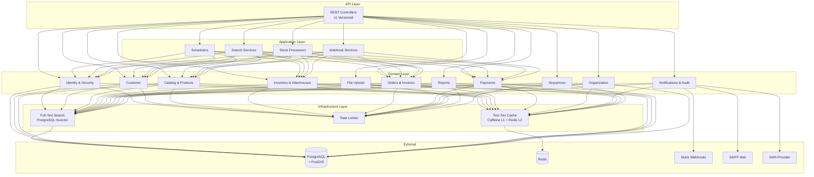
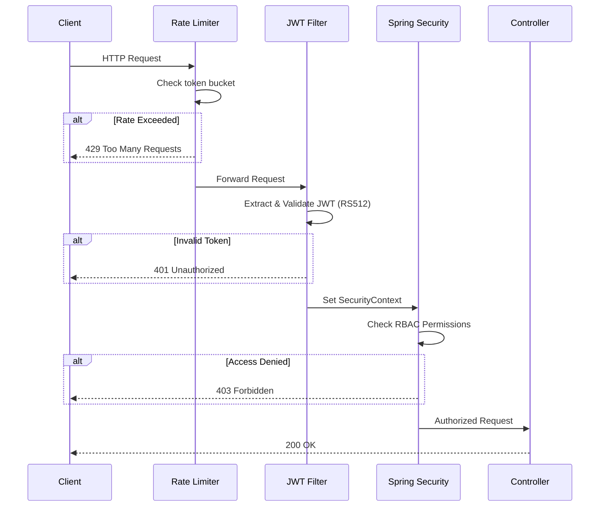
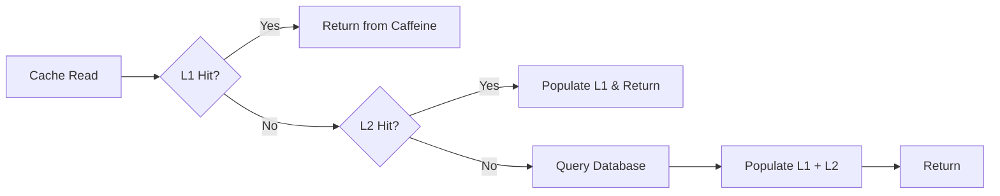
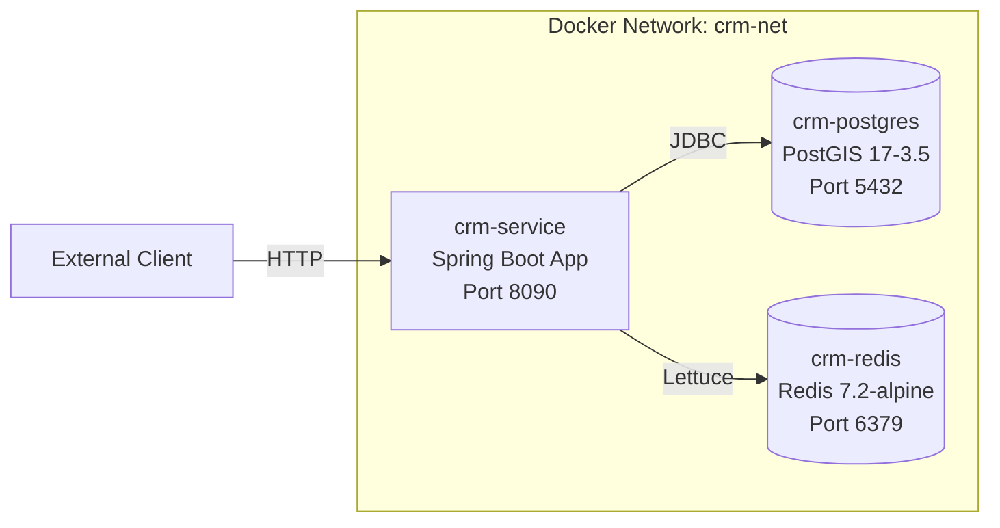

# 🏢 Bronx CRM — Project Portfolio Documentation

> **Enterprise-grade Customer Relationship Management backend** built with **Spring Boot 3**, **Java 21**, **PostgreSQL/PostGIS**, and **Redis**. Designed with **Domain-Driven Design (DDD)** and a layered architecture to manage the full lifecycle of customers, product catalogs, inventory, sales orders, invoices, payments, and organizational data.

---

## 📋 Table of Contents

1. [Overview](#overview)
2. [Architecture](#architecture)
3. [Technology Stack](#technology-stack)
4. [Project Structure](#project-structure)
5. [Domain Modules](#domain-modules)
6. [Infrastructure & Cross-Cutting Concerns](#infrastructure--cross-cutting-concerns)
7. [API Layer](#api-layer)
8. [Security Architecture](#security-architecture)
9. [Database & Migrations](#database--migrations)
10. [Caching Strategy](#caching-strategy)
11. [Scheduled Tasks](#scheduled-tasks)
12. [Testing Strategy](#testing-strategy)
13. [Deployment & DevOps](#deployment--devops)
14. [Installation & Setup](#installation--setup)
15. [Configuration Reference](#configuration-reference)
16. [Key Features Summary](#key-features-summary)

---

## Overview

**Bronx CRM** is a comprehensive, production-ready CRM backend system designed to serve as the backbone for business operations including customer management, product cataloging, inventory tracking, order processing, invoicing, and payments. The application is built as a monolithic Spring Boot application following **Domain-Driven Design (DDD)** principles, with clear boundaries between business domains.

| Attribute             | Detail                                    |
|-----------------------|-------------------------------------------|
| **Project Name**      | Bronx CRM                                |
| **Group ID**          | `com.bronx`                               |
| **Artifact**          | `crm`                                     |
| **Version**           | `1.0.0`                                   |
| **Java Version**      | 21 (with Virtual Threads)                 |
| **Framework**         | Spring Boot 3.3.5                         |
| **Database**          | PostgreSQL 17 + PostGIS 3.5               |
| **Caching**           | Redis 7.2 + Caffeine (Two-Tier L1/L2)    |
| **Architecture**      | Domain-Driven Design (DDD), Layered      |
| **Total Java Files**  | **558+**                                  |
| **API Style**         | RESTful (versioned: v1)                   |

---

## Architecture

The application follows a **layered DDD architecture** with four distinct tiers:



### Layer Responsibilities

| Layer              | Package                  | Purpose                                                                        |
|--------------------|--------------------------|--------------------------------------------------------------------------------|
| **API**            | `api.v1.*`, `api.controller.*` | REST endpoints, request/response DTOs, HTTP concerns                      |
| **Application**    | `application.*`          | Cross-domain orchestration, scheduled jobs, search coordination, webhooks      |
| **Domain**         | `domain.*`               | Core business logic, entities, repositories, domain services, mappers          |
| **Infrastructure** | `infrastructure.*`       | Technical concerns: caching strategies, rate limiting, search engine adapters  |
| **Common**         | `common.*`               | Shared utilities, base classes, exception hierarchy, annotations               |
| **Configs**        | `configs.*`              | Spring configuration: Security, JPA, Jackson, Async, Swagger, Storage          |

---

## Technology Stack

### Core Framework & Language

| Technology                | Version  | Purpose                                           |
|---------------------------|----------|---------------------------------------------------|
| **Java**                  | 21       | LTS release with Virtual Threads, Records, Pattern Matching |
| **Spring Boot**           | 3.3.5    | Application framework, auto-configuration         |
| **Spring Data JPA**       | (managed)| ORM / Repository abstraction                      |
| **Spring Security**       | (managed)| Authentication & Authorization                    |
| **Spring Retry**          | (managed)| Retry logic with exponential backoff              |
| **Spring Aspects (AOP)**  | (managed)| Cross-cutting concerns via aspects                 |
| **Virtual Threads**       | Built-in | Lightweight concurrency (Java 21)                 |

### Database & Persistence

| Technology                | Version  | Purpose                                           |
|---------------------------|----------|---------------------------------------------------|
| **PostgreSQL**            | 17       | Primary relational database                        |
| **PostGIS**               | 3.5      | Geospatial data types and queries                  |
| **Hibernate Spatial**     | (managed)| JPA integration for spatial types                  |
| **JTS Topology Suite**    | 1.19.0   | Geometry processing and spatial operations         |
| **Hypersistence Utils**   | 3.7.3    | JSON column support, Hibernate type mapping        |
| **Liquibase**             | (managed)| Database schema version control & migrations       |
| **HikariCP**              | (managed)| High-performance JDBC connection pool              |

### Caching & Performance

| Technology                | Version  | Purpose                                           |
|---------------------------|----------|---------------------------------------------------|
| **Redis**                 | 7.2      | Distributed L2 cache, session store, rate limiting |
| **Caffeine**              | (managed)| In-process L1 cache (high-speed local cache)       |
| **Spring Cache**          | (managed)| Cache abstraction with custom two-tier strategy    |
| **Commons Pool 2**        | (managed)| Redis connection pooling (Lettuce)                 |

### Security & Authentication

| Technology                | Version  | Purpose                                           |
|---------------------------|----------|---------------------------------------------------|
| **Spring Security**       | (managed)| Security filter chain, RBAC                        |
| **JJWT (jjwt-api)**      | 0.12.3   | JWT creation & validation (RS512 asymmetric keys) |
| **RSA Key Pairs**         | –        | Asymmetric JWT signing (private/public key)        |
| **OTP System**            | Custom   | Email/SMS-based one-time password verification     |
| **2FA Support**           | Custom   | Two-factor authentication token flow               |

### API Documentation & Tooling

| Technology                | Version  | Purpose                                           |
|---------------------------|----------|---------------------------------------------------|
| **SpringDoc OpenAPI**     | 2.6.0    | Swagger UI & OpenAPI 3.0 spec generation           |
| **Spring Boot Actuator**  | (managed)| Health checks, metrics, readiness/liveness probes  |

### Data Processing & Utilities

| Technology                | Version  | Purpose                                           |
|---------------------------|----------|---------------------------------------------------|
| **Apache Tika**           | 2.9.2    | MIME type detection & file content parsing         |
| **OpenCSV**               | 5.9      | CSV file import/export (locations data, reports)   |
| **MapStruct**             | 1.6.3    | Compile-time DTO ↔ Entity mapping                 |
| **Lombok**                | 1.18.36  | Boilerplate reduction (getters, builders, etc.)    |
| **Jackson JSR310**        | (managed)| Java 8+ date/time serialization                   |

### Scheduling & Distribution

| Technology                | Version  | Purpose                                           |
|---------------------------|----------|---------------------------------------------------|
| **Spring Scheduling**     | (managed)| Cron-based task scheduling                         |
| **ShedLock**              | 5.10.0   | Distributed lock for scheduled tasks (JDBC-based)  |

### Testing

| Technology                | Version  | Purpose                                           |
|---------------------------|----------|---------------------------------------------------|
| **JUnit 5**               | (managed)| Unit and integration test framework                |
| **Mockito**               | (managed)| Mocking framework                                  |
| **TestContainers**        | 1.19.8   | Ephemeral PostgreSQL/Redis for integration tests   |
| **REST Assured**          | (managed)| HTTP API integration testing                       |
| **AssertJ**               | (managed)| Fluent assertion library                           |
| **Awaitility**            | (managed)| Asynchronous test assertions                       |
| **Spring Security Test**  | (managed)| Security context mocking for tests                 |

### Deployment & Containerization

| Technology                | Version  | Purpose                                           |
|---------------------------|----------|---------------------------------------------------|
| **Docker**                | 24+      | Containerized deployment                           |
| **Docker Compose**        | v2+      | Multi-service orchestration                        |
| **Jib Maven Plugin**      | 3.4.3    | Daemonless Docker image build (no Dockerfile)      |
| **Eclipse Temurin**       | 21-jre-alpine | Lightweight JRE base image                   |

---

## Project Structure

```
crm/
├── src/
│   ├── main/
│   │   ├── java/com/bronx/crm/
│   │   │   ├── CrmApplication.java              # Entry point (@EnableScheduling, @EnableRetry)
│   │   │   │
│   │   │   ├── api/                              # 🌐 REST API Layer
│   │   │   │   ├── controller/test/              #   └─ Cache test endpoints
│   │   │   │   └── v1/                           #   └─ Versioned API (v1)
│   │   │   │       ├── audit/                    #       ├─ AuditLogController
│   │   │   │       ├── auth/                     #       ├─ AuthController
│   │   │   │       ├── catalog/                  #       ├─ Brand, Category, Product, Tag, Unit, PriceHistory
│   │   │   │       ├── customer/                 #       ├─ CustomerController
│   │   │   │       ├── file/                     #       ├─ FileController
│   │   │   │       ├── identity/                 #       ├─ User, Role, Permission, Group
│   │   │   │       ├── inventory/                #       ├─ Stock, StockMovement, Warehouse, Import
│   │   │   │       ├── invoice/                  #       ├─ InvoiceController
│   │   │   │       ├── locations/                #       ├─ LocationController
│   │   │   │       ├── notification/             #       ├─ NotificationController
│   │   │   │       ├── order/                    #       ├─ OrderController
│   │   │   │       ├── organization/             #       ├─ Company, Department, Division
│   │   │   │       ├── payment/                  #       ├─ PaymentController
│   │   │   │       ├── report/                   #       ├─ ReportDashboardController
│   │   │   │       └── uploads/                  #       └─ UploadController
│   │   │   │
│   │   │   ├── application/                      # ⚙️ Application Services (Orchestration)
│   │   │   │   ├── scheduler/                    #   ├─ AuthenticationScheduledTasks
│   │   │   │   │                                 #   ├─ IdempotencyCleanupScheduler
│   │   │   │   │                                 #   ├─ LowStockNotificationJob
│   │   │   │   │                                 #   ├─ OtpCleanupScheduler
│   │   │   │   │                                 #   └─ ProductStockUpdateScheduler
│   │   │   │   ├── search/                       #   ├─ Cross-domain search coordination
│   │   │   │   ├── stock/                        #   ├─ Stock-level application logic
│   │   │   │   └── webhook/                      #   └─ SlackService (Slack integration)
│   │   │   │
│   │   │   ├── common/                           # 🔧 Shared Utilities
│   │   │   │   ├── annotation/                   #   ├─ Custom annotations
│   │   │   │   ├── audit/                        #   ├─ Audit base classes
│   │   │   │   ├── dto/                          #   ├─ Shared DTOs (ApiResponse, PageResponse)
│   │   │   │   ├── exception/                    #   ├─ Exception hierarchy (14 exception types)
│   │   │   │   ├── service/                      #   ├─ Base service abstractions
│   │   │   │   └── utils/                        #   └─ Utility classes
│   │   │   │
│   │   │   ├── configs/                          # ⚙️ Spring Configuration
│   │   │   │   ├── async/                        #   ├─ Async thread pool config
│   │   │   │   ├── properties/                   #   ├─ Custom @ConfigurationProperties
│   │   │   │   ├── security/                     #   ├─ SecurityConfig (filter chain, CORS)
│   │   │   │   ├── CustomFunctionContributor.java#   ├─ Hibernate function registration
│   │   │   │   ├── IdempotencyConfig.java        #   ├─ Idempotent request handling
│   │   │   │   ├── JacksonConfig.java            #   ├─ JSON serialization config
│   │   │   │   ├── JpaConfig.java                #   ├─ JPA auditing & HikariCP tuning
│   │   │   │   ├── RestClientConfig.java         #   ├─ HTTP client configuration
│   │   │   │   ├── SchedulerConfig.java          #   ├─ ShedLock + scheduling config
│   │   │   │   └── StorageAutoConfiguration.java #   └─ File storage strategy resolver
│   │   │   │
│   │   │   ├── domain/                           # 🏛️ Domain Layer (Core Business Logic)
│   │   │   │   ├── audit/                        #   ├─ Activity logs (entity, repo, service, dto)
│   │   │   │   ├── catalog/                      #   ├─ Product catalog
│   │   │   │   │   ├── brand/                    #   │   ├─ Brands
│   │   │   │   │   ├── category/                 #   │   ├─ Categories (hierarchical)
│   │   │   │   │   ├── product/                  #   │   ├─ Products, variants, attributes, events
│   │   │   │   │   ├── tag/                      #   │   ├─ Tags
│   │   │   │   │   └── unit/                     #   │   └─ Units of measurement, conversions, pricing
│   │   │   │   ├── customer/                     #   ├─ Customer profiles (PostGIS locations)
│   │   │   │   ├── fileUpload/                   #   ├─ File handling (entity, storage, utils)
│   │   │   │   ├── identity/                     #   ├─ Identity & Access Management
│   │   │   │   │   ├── action/                   #   │   ├─ Auditable actions
│   │   │   │   │   ├── group/                    #   │   ├─ User groups
│   │   │   │   │   ├── permission/               #   │   ├─ Permissions
│   │   │   │   │   ├── permissionGrant/          #   │   ├─ Permission grants (with exclusions)
│   │   │   │   │   ├── role/                     #   │   ├─ Roles
│   │   │   │   │   └── user/                     #   │   └─ Users & user profiles
│   │   │   │   ├── inventory/                    #   ├─ Inventory Management
│   │   │   │   │   ├── imports/                  #   │   ├─ Import processing
│   │   │   │   │   ├── movement/                 #   │   ├─ Stock movement tracking
│   │   │   │   │   ├── stock/                    #   │   ├─ Real-time stock levels
│   │   │   │   │   ├── supplier/                 #   │   ├─ Supplier management
│   │   │   │   │   └── warehouse/                #   │   └─ Warehouse management
│   │   │   │   ├── invoice/                      #   ├─ Invoice lifecycle
│   │   │   │   ├── notification/                 #   ├─ Notification system
│   │   │   │   ├── order/                        #   ├─ Sales order workflow
│   │   │   │   ├── organization/                 #   ├─ Organizational hierarchy
│   │   │   │   │   ├── company/                  #   │   ├─ Companies
│   │   │   │   │   ├── department/               #   │   ├─ Departments
│   │   │   │   │   ├── division/                 #   │   ├─ Divisions
│   │   │   │   │   └── location/                 #   │   └─ Locations (CSV + geospatial)
│   │   │   │   ├── payment/                      #   ├─ Payment processing (idempotent)
│   │   │   │   ├── report/                       #   ├─ Dashboard & reporting
│   │   │   │   ├── security/                     #   ├─ Security domain
│   │   │   │   │   ├── auth/                     #   │   ├─ Auth service, login attempt tracking
│   │   │   │   │   ├── jwt/                      #   │   ├─ JWT token service (RSA-512)
│   │   │   │   │   └── otp/                      #   │   └─ OTP, Email, SMS, password reset
│   │   │   │   └── sequence/                     #   └─ Number sequence generator
│   │   │   │
│   │   │   └── infrastructure/                   # 🏗️ Infrastructure Layer
│   │   │       ├── cache/                        #   ├─ Two-tier caching (config, core, strategy)
│   │   │       ├── rateLimit/                    #   ├─ Rate limiting (aspect, filter, model, strategy)
│   │   │       └── search/                       #   └─ Full-text search (core, dto, spec, strategy)
│   │   │
│   │   └── resources/
│   │       ├── application.yaml                  # Base configuration (all profiles)
│   │       ├── application-dev.yaml              # Dev profile overrides
│   │       ├── application-prod.yaml             # Production profile overrides
│   │       ├── banner.txt                        # Custom startup banner
│   │       ├── db/changelog/                     # Liquibase migrations
│   │       │   ├── db.changelog-master.yaml      #   ├─ Master changelog
│   │       │   ├── db.changelog-001-shedlock.yaml#   ├─ ShedLock table
│   │       │   ├── db.changelog-002-postgis.yaml #   ├─ PostGIS extension
│   │       │   └── db.changelog-003-fts.yaml     #   └─ Full-text search indexes
│   │       └── locations/                        # Cambodia administrative boundary CSVs
│   │           ├── provinces.csv
│   │           ├── districts.csv
│   │           ├── communes.csv
│   │           └── villages.csv
│   │
│   └── test/
│       ├── java/com/bronx/crm/
│       │   ├── CrmApplicationTests.java          # Spring context smoke test
│       │   └── v1/InventoryFlow/                 # E2E inventory integration test
│       └── resources/
│           ├── sql/                              # Test seed/cleanup SQL
│           └── application-test.yml              # Test profile config
│
├── scripts/                                       # 🚀 Deployment Scripts
│   ├── 01_build.sh                               #   Build & package via Jib
│   ├── 02_save-images.sh                         #   Export Docker images
│   ├── 03_transfer_image.sh                      #   Transfer images to remote server
│   ├── 04_deploy.sh                              #   Deploy to production
│   └── generate-keys.sh                          #   RSA JWT key pair generator
│
├── .keys/                                         # Generated RSA keys (git-ignored)
├── .env.example                                   # Environment variable template
├── docker-compose.yaml                            # PostgreSQL + Redis + App orchestration
├── init-postgis.sql/                              # PostGIS initialization SQL
└── pom.xml                                        # Maven build configuration
```

---

## Domain Modules

### 1. 🔐 Identity & Access Management (`domain.identity`)

Manages users, roles, permissions, and groups with a sophisticated permission resolution system.

| Sub-module          | Components                                              |
|---------------------|---------------------------------------------------------|
| **user**            | `UserService`, `UserProfileService`, `UserRepository`, `UserProfileRepository` |
| **role**            | `RoleService`, `RoleRepository`                        |
| **permission**      | `PermissionService`, `PermissionResolverService`, `PermissionRepository` |
| **permissionGrant** | `PermissionGrantRepository`, role/group/user exclusion repositories |
| **group**           | `GroupService`, `GroupRepository`                       |
| **action**          | `ActionService`, `ActionRepository`                    |

> **Highlights:** Fine-grained RBAC with permission grants, exclusions at role/group/user level, and a resolver service that computes effective permissions.

---

### 2. 🛡️ Security (`domain.security`)

Handles authentication, JWT token management, OTP, and account protection.

| Sub-module   | Components                                                    |
|--------------|---------------------------------------------------------------|
| **auth**     | `AuthService`, `LoginAttemptService`, `CustomUserDetailsService` |
| **jwt**      | `JwtService` — RS512 asymmetric signing, access/refresh tokens |
| **otp**      | `OtpService`, `EmailService`, `SmsService`, `PasswordResetTokenRepository` |

> **Highlights:**
> - **RSA-512 JWT** with configurable access (20 min) / refresh (7 day) token expiration
> - **Login attempt tracking** with automatic account lockout (configurable max attempts & lockout duration)
> - **2FA support** with OTP via Email/SMS, cooldown enforcement, and max attempt limits
> - **Password reset** flow with time-limited tokens

---

### 3. 📦 Product Catalog (`domain.catalog`)

Rich product hierarchy with variants, attributes, price history, brands, categories, tags, and units.

| Sub-module    | Components                                                   |
|---------------|--------------------------------------------------------------|
| **product**   | `ProductService`, `ProductEnrichmentService`, `ProductVariantService`, `VariantGenerationService`, `ProductOperationsSearchService`, product events & history |
| **brand**     | Brand entity, repository, service                            |
| **category**  | Hierarchical category entity, repository, service            |
| **tag**       | `TagService`, `TagRepository`                                |
| **unit**      | `UnitService`, `UnitConversionService`, `ProductUnitService`, `ProductUnitPriceService` |

> **Highlights:**
> - Variant generation with attribute-value combinations
> - Product enrichment pipeline
> - Full-text search with PostgreSQL `tsvector` + GIN indexes
> - Price history tracking
> - Unit conversion between measurement units

---

### 4. 👤 Customer Management (`domain.customer`)

Customer profiles with geospatial location data powered by PostGIS.

| Components | `CustomerService`, `CustomerRepository`                        |
|------------|----------------------------------------------------------------|
| **Entities** | Customer entity with PostGIS `Point` geometry for locations  |
| **DTOs**     | Request/Response DTOs with MapStruct mapping                 |

> **Highlights:** Spatial queries for location-based customer lookups using Hibernate Spatial and JTS.

---

### 5. 📊 Inventory Management (`domain.inventory`)

Complete inventory system with stock tracking, warehouses, suppliers, imports, and movement history.

| Sub-module    | Components                                                  |
|---------------|-------------------------------------------------------------|
| **stock**     | `StockService`, `StockSearchService`, `StockRepository`    |
| **warehouse** | `WarehouseService`, `WarehouseRepository`                  |
| **supplier**  | `SupplierService`, `SupplierRepository`                    |
| **movement**  | `StockMovementService`, `StockMovementRepository`          |
| **imports**   | `ImportService`, `ImportRepository`, `ImportItemRepository`, `WarehouseImportRepository` |

> **Highlights:**
> - Real-time stock tracking with L1/L2 cache (1-minute TTL for hot data)
> - Stock movement audit trail
> - Warehouse-level allocation and import processing
> - Low-stock notification alerts (scheduled job → Slack)

---

### 6. 🛒 Order Management (`domain.order`)

Structured sales order processing with line items and workflow states.

| Components | `OrderService`, `OrderRepository`, `OrderItemRepository`      |
|------------|----------------------------------------------------------------|
| **Features** | Order creation, status workflow, line item management, cached lookups |

---

### 7. 🧾 Invoice Management (`domain.invoice`)

Invoice lifecycle management linked to sales orders.

| Components | `InvoiceService`, `InvoiceRepository`, MapStruct mapper       |
|------------|---------------------------------------------------------------|
| **Features** | Invoice generation, status transitions, order linkage        |

---

### 8. 💳 Payment Processing (`domain.payment`)

Idempotent payment handling with clean separation of payment flows.

| Components | `PaymentService`, `PaymentIdempotencyService`, `PaymentRepository`, `PaymentIdempotencyRepository` |
|------------|------------------------------------------------------------|
| **Features** | Idempotent payment processing, configurable TTL, duplicate prevention |

---

### 9. 🏢 Organization (`domain.organization`)

Hierarchical organizational structure with geospatial location support.

| Sub-module    | Components                                                  |
|---------------|-------------------------------------------------------------|
| **company**   | `CompanyService`, `CompanyRepository`                      |
| **department**| `DepartmentService`, `DepartmentRepository`                |
| **division**  | `DivisionService`, `DivisionRepository`                    |
| **location**  | `LocationService`, `LocationLoaderService` + Cambodia admin boundary data (provinces, districts, communes, villages via CSV import) |

---

### 10. 🔔 Notification (`domain.notification`)

Event-driven notification system with persistence and delivery tracking.

| Components | `NotificationService`, `NotificationRepository`               |
|------------|----------------------------------------------------------------|
| **Channels** | In-app notifications, Email (SMTP), SMS, Slack webhooks     |

---

### 11. 📝 Audit Logging (`domain.audit`)

Comprehensive activity tracking and audit trail.

| Components | Audit entity, repository, service, DTOs                       |
|------------|---------------------------------------------------------------|
| **Features** | Automatic activity logging, queryable audit history          |

---

### 12. 📈 Reporting (`domain.report`)

Dashboard and reporting services for data aggregation.

| Components | `ReportDashboardService`, DTOs                                |
|------------|---------------------------------------------------------------|
| **Features** | Aggregated metrics, configurable dashboard data              |

---

### 13. 📁 File Upload (`domain.fileUpload`)

Pluggable file storage with strategy pattern for different backends.

| Components | `FileService`, `FileRepository`, storage strategies, file utilities |
|------------|----------------------------------------------------------------|
| **Supported Types** | IMAGE, PDF (configurable whitelist)                    |
| **Strategies** | LOCAL (default), extensible to S3/cloud                   |
| **File Validation** | MIME type detection via Apache Tika                    |

---

### 14. 🔢 Sequence Generation (`domain.sequence`)

Database-backed number sequence generator for order numbers, invoice numbers, etc.

| Components | `NumberSequenceService`, `NumberSequenceRepository`            |
|------------|---------------------------------------------------------------|

---

## Infrastructure & Cross-Cutting Concerns

### Two-Tier Caching (`infrastructure.cache`)

A custom-built **L1 (Caffeine) + L2 (Redis)** caching system with per-cache-spec configuration:

```
┌──────────────────┐     ┌──────────────────┐     ┌───────────────┐
│   Application    │────▶│  L1: Caffeine    │────▶│  L2: Redis    │
│   (Cache Read)   │     │  (In-Process)    │     │  (Distributed)│
│                  │     │  TTL: 1-5 min    │     │  TTL: 5m-2h   │
└──────────────────┘     └──────────────────┘     └───────────────┘
```

**Configured Cache Specs:**

| Cache Name               | L1 Max Size | L1 TTL | L2 TTL | Level |
|--------------------------|-------------|--------|--------|-------|
| `product:by-id`          | 1000        | 5m     | 2h     | L1_L2 |
| `product:search-page`    | 200         | 2m     | 30m    | L1_L2 |
| `order:by-id`            | 500         | 3m     | 1h     | L1_L2 |
| `order:page`             | 100         | 1m     | 15m    | L1_L2 |
| `stock:by-variant`       | 500         | 1m     | 5m     | L1_L2 |
| `stock:by-variant-warehouse` | 500     | 1m     | 5m     | L1_L2 |
| `stock:search-page`      | 100         | 1m     | 5m     | L1_L2 |

### Rate Limiting (`infrastructure.rateLimit`)

Token-bucket rate limiter with Redis-backed state and local fallback:

- **Architecture:** Aspect-based + filter-based enforcement
- **Key Strategy:** IP-based (configurable)
- **Default Bucket:** 20 requests / 60 seconds
- **Auth Endpoints:** 10 requests / 60 seconds (stricter)
- **Response Headers:** `X-RateLimit-Remaining`, `X-RateLimit-Limit`, `X-RateLimit-Reset`, `Retry-After`
- **Fallback:** Local in-memory when Redis is unavailable

### Full-Text Search (`infrastructure.search`)

PostgreSQL-native full-text search with `tsvector` columns and GIN indexes:

- **Strategy Pattern:** Pluggable search strategies per entity type
- **Specification-based:** JPA Specifications for type-safe query building
- **Product Search:** Full-text indexing on product names, descriptions, SKUs (Liquibase migration `003`)

---

## API Layer

### REST Controllers (29 endpoints across 15 resource groups)

| Controller                    | Base Path                       | Key Operations                                  |
|-------------------------------|--------------------------------|--------------------------------------------------|
| `AuthController`              | `/api/auth`                    | Login, register, refresh, OTP, password reset    |
| `UserController`              | `/api/v1/users`                | CRUD, profile management                         |
| `RoleController`              | `/api/v1/roles`                | Role CRUD, permission assignment                 |
| `PermissionController`        | `/api/v1/permissions`          | Permission listing and management                |
| `GroupController`             | `/api/v1/groups`               | User group management                            |
| `ProductController`           | `/api/v1/products`             | CRUD, variants, search, price history            |
| `CategoryController`          | `/api/v1/categories`           | Hierarchical category CRUD                       |
| `BrandController`             | `/api/v1/brands`               | Brand CRUD                                       |
| `TagController`               | `/api/v1/tags`                 | Tag CRUD                                         |
| `UnitController`              | `/api/v1/units`                | Unit of measurement CRUD                         |
| `CustomerController`          | `/api/v1/customers`            | Customer CRUD, geospatial queries                |
| `StockController`             | `/api/v1/stocks`               | Stock levels, search                             |
| `StockMovementController`     | `/api/v1/stock-movements`      | Movement history                                 |
| `WarehouseController`         | `/api/v1/warehouses`           | Warehouse CRUD                                   |
| `ImportController`            | `/api/v1/imports`              | Import processing                                |
| `OrderController`             | `/api/v1/orders`               | Order lifecycle                                  |
| `InvoiceController`           | `/api/v1/invoices`             | Invoice management                               |
| `PaymentController`           | `/api/v1/payments`             | Payment processing                               |
| `CompanyController`           | `/api/v1/companies`            | Company management                               |
| `DepartmentController`        | `/api/v1/departments`          | Department management                            |
| `DivisionController`          | `/api/v1/divisions`            | Division management                              |
| `LocationController`          | `/api/v1/locations`            | Location lookups (provinces/districts/etc.)       |
| `NotificationController`      | `/api/v1/notifications`        | Notification listing and management              |
| `AuditLogController`          | `/api/v1/audit-logs`           | Audit trail queries                              |
| `ReportDashboardController`   | `/api/v1/reports/dashboard`    | Dashboard analytics                              |
| `FileController`              | `/api/v1/files`                | File serving                                     |
| `UploadController`            | `/api/v1/uploads`              | File upload handling                             |
| `PriceHistoryController`      | `/api/v1/price-history`        | Price change tracking                            |

---

## Security Architecture



### Key Security Features

- ✅ **RS512 asymmetric JWT** — Private key signs, public key verifies
- ✅ **Access + Refresh token** pattern with configurable expiration
- ✅ **Account lockout** after N failed login attempts
- ✅ **2FA** via OTP (Email / SMS) with rate limiting & cooldown
- ✅ **Password reset** with time-limited tokens
- ✅ **IP-based rate limiting** with Redis-backed token buckets
- ✅ **Custom exception handlers** (401, 403 with structured error responses)
- ✅ **CORS configuration** via Spring Security
- ✅ **Dev mode** toggle for relaxed JWT validation during development

---

## Database & Migrations

### PostgreSQL + PostGIS

- **PostGIS 3.5** extension for geospatial data types (`Point`, `Geometry`)
- **Hibernate Spatial** dialect for transparent JPA integration
- **HikariCP** connection pool with leak detection (threshold: 60s)
- **DDL Strategy:** `validate` in production (schema managed by Liquibase)

### Liquibase Changelog

| Migration                                | Purpose                                          |
|------------------------------------------|--------------------------------------------------|
| `001-shedlock-tb`                        | ShedLock distributed lock table                  |
| `002-add-postgis`                        | Enable PostGIS extension                         |
| `003-add-fts-products`                   | Full-text search: `tsvector` columns + GIN index |

---

## Caching Strategy



- **L1 (Caffeine):** In-process, nanosecond access, max 100–1000 entries per spec
- **L2 (Redis):** Distributed, microsecond access via Lettuce with connection pooling
- **Eviction:** Custom `CacheEvictionService` for targeted invalidation
- **Null caching:** Configurable null-value TTL (2 min) to prevent cache stampede

---

## Scheduled Tasks

| Scheduler                       | Purpose                                           | Lock       |
|---------------------------------|---------------------------------------------------|------------|
| `AuthenticationScheduledTasks`  | Clean expired login attempts & sessions           | ShedLock   |
| `IdempotencyCleanupScheduler`   | Purge expired idempotency keys                    | ShedLock   |
| `LowStockNotificationJob`      | Detect low stock → Slack/email notifications      | ShedLock   |
| `OtpCleanupScheduler`          | Delete expired OTP records                        | ShedLock   |
| `ProductStockUpdateScheduler`  | Sync denormalized stock counts on products        | ShedLock   |

> All scheduled tasks use **ShedLock** with JDBC-backed locking to prevent duplicate execution in multi-instance deployments.

---

## Testing Strategy

| Layer                | Framework         | Approach                                        |
|----------------------|-------------------|-------------------------------------------------|
| **Unit Tests**       | JUnit 5 + Mockito | Service-level isolated tests                    |
| **Integration Tests**| TestContainers    | Real PostgreSQL + Redis in ephemeral containers |
| **E2E API Tests**    | REST Assured      | Full HTTP request/response cycle                |
| **Assertions**       | AssertJ           | Fluent, readable assertion chains               |
| **Async Tests**      | Awaitility        | Polling-based assertions for async operations   |
| **Security Tests**   | Spring Security Test | MockUser, CSRF, role-based access checks     |

---

## Deployment & DevOps

### Docker Compose Architecture



### Container Configuration

| Service       | Image                    | Healthcheck                  | Resources      |
|---------------|--------------------------|------------------------------|----------------|
| `crm-service` | `bronx/crm:dev`         | Actuator `/health` endpoint  | 768 MB limit   |
| `postgres`    | `postgis/postgis:17-3.5`| `pg_isready`                 | –              |
| `redis`       | `redis:7.2-alpine`      | `redis-cli ping`             | –              |

### Build Pipeline

```bash
# 1. Build Docker image (Jib — no Dockerfile needed)
./scripts/01_build.sh

# 2. Export Docker image to tarball
./scripts/02_save-images.sh

# 3. Transfer image to remote server via SCP/SSH
./scripts/03_transfer_image.sh

# 4. Deploy on remote server
./scripts/04_deploy.sh
```

### JVM Tuning (Production)

```
-XX:+UseContainerSupport
-XX:MaxRAMPercentage=75.0
-XX:+UseG1GC
-XX:MaxGCPauseMillis=200
-XX:+UseStringDeduplication
-Djava.security.egd=file:/dev/./urandom
-Dfile.encoding=UTF-8
-Duser.timezone=Asia/Phnom_Penh
```

---

## Installation & Setup

### Prerequisites

| Tool            | Version | Notes                              |
|-----------------|---------|-------------------------------------|
| **Java**        | 21+     | Required for build                  |
| **Maven**       | 3.9+    | Via `./mvnw` wrapper (no install)   |
| **Docker**      | 24+     | Must be running                     |
| **Docker Compose** | v2+  | Use `docker compose`               |
| **OpenSSL**     | any     | For JWT key generation              |

### Quick Start

```bash
# 1. Clone the repository
git clone <repository-url>
cd crm

# 2. Create environment file
cp .env.example .env
# Edit .env — change passwords, ports as needed
# JWT keys are auto-generated on first build

# 3. Make scripts executable
chmod +x scripts/*.sh

# 4. Build and run
cd scripts
./01_build.sh
```

### Local Development

```bash
# Start infrastructure services only
docker compose up -d postgres redis

# Run application locally with dev profile
SPRING_PROFILES_ACTIVE=dev ./mvnw spring-boot:run

# Access Swagger UI (dev profile only)
open http://localhost:8090/api/swagger-ui.html
```

---

## Configuration Reference

### Spring Profiles

| Profile  | Use For            | Behaviour                                                                 |
|----------|--------------------|---------------------------------------------------------------------------|
| **dev**  | Local development  | SQL logging ON, Swagger enabled, all actuator endpoints, rate limiter OFF |
| **prod** | Production/Docker  | SQL logging OFF, Swagger disabled, strict JWT, `ddl-auto: validate`      |

### Environment Variables

| Variable                    | Default            | Description                                  |
|-----------------------------|--------------------|----------------------------------------------|
| `APP_PORT`                  | `8090`             | Application HTTP port                        |
| `SPRING_PROFILES_ACTIVE`   | `dev`              | Active Spring profile                        |
| `POSTGRES_DB`              | `crm_app`          | Database name                                |
| `POSTGRES_USER`            | `postgres`         | Database username                            |
| `POSTGRES_PASSWORD`        | `crm-bot@123`      | Database password                            |
| `POSTGRES_HOST_PORT`       | `54323`            | Host-mapped PostgreSQL port                  |
| `REDIS_HOST_PORT`          | `63790`            | Host-mapped Redis port                       |
| `REDIS_PASSWORD`           | *(empty)*          | Redis password (optional)                    |
| `JWT_PRIVATE_KEY`          | *(auto-generated)* | Base64-encoded RSA private key               |
| `JWT_PUBLIC_KEY`           | *(auto-generated)* | Base64-encoded RSA public key                |
| `JWT_ISSUER`               | `crm-app`          | JWT issuer claim                             |
| `JWT_DEV_MODE`             | `false`            | Relax JWT validation in dev                  |
| `MAIL_ENABLED`             | `false`            | Enable email notifications                   |
| `SMS_ENABLED`              | `false`            | Enable SMS notifications                     |
| `SLACK_ENABLED`            | `false`            | Enable Slack webhook notifications           |
| `SLACK_WEBHOOK_URL`        | *(empty)*          | Slack incoming webhook URL                   |
| `UPLOAD_STRATEGY`          | `LOCAL`            | File storage strategy                        |
| `RATE_LIMITER_ENABLED`     | `true`             | Enable/disable rate limiting                 |
| `IMAGE_REPO`               | `bronx`            | Docker image repository                      |
| `IMAGE_NAME`               | `crm`              | Docker image name                            |
| `IMAGE_TAG`                | `dev`              | Docker image tag                             |

---

## Key Features Summary

| Category                  | Feature                                                            |
|---------------------------|--------------------------------------------------------------------|
| **🔐 Security**           | RSA-512 JWT, RBAC, 2FA/OTP, account lockout, rate limiting        |
| **👤 Identity**           | Users, Roles, Permissions, Groups, fine-grained permission grants |
| **📦 Catalog**            | Products, variants, attributes, brands, categories, tags, units   |
| **📊 Inventory**          | Stock tracking, warehouses, suppliers, imports, movement history   |
| **🛒 Orders**             | Sales order lifecycle, line items, status workflow                 |
| **🧾 Invoicing**          | Invoice generation, status management, order linkage              |
| **💳 Payments**           | Idempotent payment processing, duplicate prevention               |
| **🏢 Organization**       | Company → Division → Department hierarchy, locations              |
| **🌍 Geospatial**         | PostGIS-powered customer/location spatial queries                 |
| **🔍 Search**             | PostgreSQL full-text search (tsvector + GIN)                      |
| **⚡ Caching**            | Two-tier L1 (Caffeine) + L2 (Redis) with per-spec TTLs           |
| **🚦 Rate Limiting**      | Token-bucket with Redis state, IP-based, route-specific rules     |
| **📧 Notifications**      | Email (SMTP), SMS, Slack webhooks, in-app notifications           |
| **📝 Audit Trail**        | Activity logging, queryable audit history                         |
| **📁 File Management**    | Upload/download with MIME validation (Tika), pluggable storage    |
| **🔄 Scheduling**         | ShedLock-protected scheduled tasks (cleanup, alerts, sync)        |
| **🐳 Containerization**   | Jib-based Docker builds, Docker Compose, health checks            |
| **🧪 Testing**            | TestContainers, REST Assured, E2E integration tests               |
| **☕ Modern Java**         | Java 21 Virtual Threads, Records, Spring Boot 3.3                 |
| **📐 Architecture**       | DDD, layered architecture, MapStruct, Lombok, strategy patterns   |

---

> **Bronx CRM** — A production-ready, enterprise-grade CRM backend showcasing modern Java development practices, DDD architecture, and comprehensive business domain coverage.
