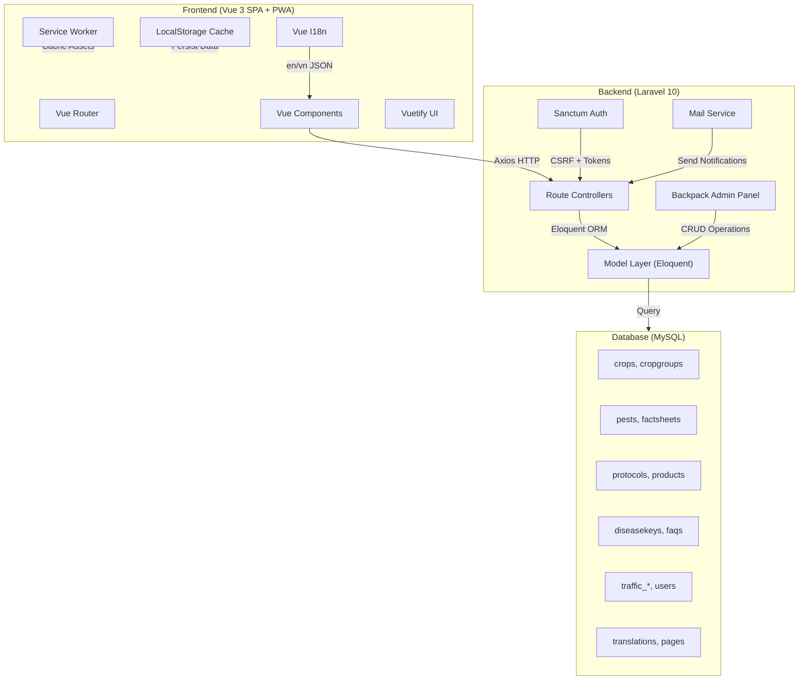
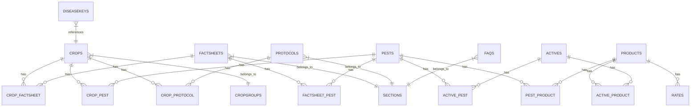

# CQH — Cambodia Crop Quality Hub (Back Pocket Grower)

> **A bilingual Progressive Web Application (PWA) for agricultural knowledge management — delivering pest & disease identification, crop protection protocols, agrochemical databases, and training resources to farmers and agronomists across Cambodia.**

---

## Project Overview

**CQH (Crop Quality Hub)**, also known as **Back Pocket Grower (BPG)**, is a full-stack web application built to provide Cambodian farmers, agronomists, and agricultural extension officers with instant, offline-capable access to critical crop protection information. The platform supports **bilingual content** in English and Khmer (Cambodian) and is designed as a **Progressive Web App (PWA)** for seamless use on mobile devices in the field, even with limited connectivity.

| Attribute           | Details                                        |
|---------------------|-------------------------------------------------|
| **Platform**        | Web Application (PWA)                           |
| **Domain**          | Agriculture / Crop Protection                   |
| **Target Users**    | Farmers, Agronomists, Extension Officers        |
| **Languages**       | English, Khmer (Cambodian)                      |
| **Architecture**    | Monolithic SPA (Laravel + Vue.js)               |

---

## Key Features

### 1. Pest & Disease Control Module
A comprehensive, hierarchical pest and disease management system that enables users to identify and find control measures for crop pests and diseases.

- **Crop Listing by Group** — Browse crops organized by crop groups (e.g., vegetables, fruits), with bilingual name support (English/Khmer)
- **Pest & Disease Browsing** — View pests and diseases associated with specific crops, with thumbnail images, Latin names, and alternative names
- **Control Details** — Detailed factsheets and recommended active ingredients for controlling specific pests, including:
  - Mode of Action (MoA) group codes
  - Withholding period (WHP) information
  - Poison group classifications
- **Traffic Tracking** — Automatic logging of which pests are most frequently viewed for analytics

### 2. Factsheet Management System
Rich, structured factsheets providing detailed agricultural guidance.

- **Multi-section Content** — Each factsheet supports up to 4 content sections with headings and rich text
- **Image Carousels** — Embedded image galleries for visual guidance
- **Crop Associations** — Factsheets linked to specific crops via many-to-many relationships
- **Pest Linkage** — Factsheets associated with specific pests for targeted information
- **Bilingual Content** — Full support for English and Khmer content
- **Versioning & Authorship** — Track document versions, authors, reviewers, and publication dates
- **SEO-friendly Slugs** — Auto-generated URL slugs using Eloquent Sluggable

### 3. Crop Protection Protocols
Detailed, multi-section protocol documents for crop protection best practices.

- **16 Content Sections** — Support for up to 16 sub-headings and content sections per protocol
- **Multiple Image Carousels** — Up to 16 separate image carousels with accompanying text
- **Ordered Sections** — Individual section ordering for flexible content arrangement
- **Crop Relationships** — Protocols linked to crops for contextual navigation
- **Online/Offline Toggling** — Admin control over protocol visibility

### 4. Interactive Disease Identification Keys
A tree-structured diagnostic tool that guides users through symptom-based disease identification.

- **Hierarchical Tree Structure** — Parent-child node system built recursively from flat database records
- **Visual Aids** — Each decision node can include diagnostic images with attribution credits
- **Bilingual Decision Nodes** — English and Khmer node labels
- **Pest Resolution** — Terminal nodes link directly to pest/disease records for immediate identification
- **Dynamic Tree Building** — Backend algorithm constructs tree hierarchies from flat database records

### 5. Agrochemical Product Database
Comprehensive database of agricultural chemical products with detailed safety and usage information.

- **Product Information** — Product names, formulations, registration numbers, label descriptions
- **Active Ingredients** — Links to active ingredient records with MoA group codes
- **Safety Data** — Toxicity, ecotoxicity, first aid, PPE requirements, poison group classifications
- **Usage Details** — Application methods, withholding periods (WHP), re-entry intervals (REI), maximum sprays
- **Resistance Management** — Resistance status, group codes, and management recommendations
- **IPM Integration** — Integrated Pest Management compatibility notes
- **Product Files** — Links to label files, hazard notes, and Safety Data Sheets (SDS)
- **Interactive Product Lookup** — Click on an active ingredient to view all associated commercial products in a modal dialog
- **Product Type Classification** — Fungicide, Insecticide, Bactericide, Miticide, Adjuvant, Herbicide categorization

### 6. Global Search Engine
Full-text search across all content types with relevance-based result merging.

- **Multi-entity Search** — Simultaneously searches across:
  - Crops (English & Khmer names)
  - Pests & Diseases (names, alternative names, Latin names)
  - Factsheets (by crop and crop group association)
  - Protocols (titles and subtitles)
  - Agrochemical Products & Active Ingredients
  - Disease Keys
- **Smart Pluralization** — Automatic singular/plural handling for English search terms
- **Relevance Scoring** — Results tagged with relevance levels (direct match vs. group match)
- **Bilingual Search** — Search queries work in both English and Khmer

### 7. FAQ System
Structured FAQ module organized by sections for common agricultural questions.

- **Section-based Organization** — FAQs categorized by topics (General, Pests, Diseases, Husbandry)
- **Rich Text Q&A** — Questions and answers support rich HTML content
- **Bilingual Support** — FAQ content available in both supported languages
- **Ordered Display** — Custom ordering for FAQ priority

### 8. Training Resources Module
Account-based training resource management with expiration-based caching.

- **Account-based Access** — Training materials assigned to specific user accounts
- **Accordion-style Navigation** — Grouped training resources with expandable sections
- **Content Caching** — LocalStorage-based caching with configurable expiration times
- **State Persistence** — Accordion open/close states preserved across navigation via SessionStorage

### 9. Contact & Collaboration Management
Contact directory for project participants, university collaborators, and research partners.

- **Contact Profiles** — Display honorifics, names, emails, organizations, and role descriptions with profile photos
- **University Collaborators** — Dedicated section for academic partners with logos and links
- **Research Partners** — Showcase research organizations and sponsors
- **About Section** — Contextual project background information

### 10. Content Management System (Admin Panel)
Full-featured admin panel built with Laravel Backpack for non-technical content managers.

- **32 CRUD Controllers** — Complete admin interfaces for managing:
  - Crops, Crop Groups, and Crop-Pest relationships
  - Pests, Diseases, and Disease Keys
  - Factsheets, Protocols, and FAQs
  - Products, Active Ingredients, and Application Rates
  - Translations and multilingual content
  - GAP (Good Agricultural Practice) records
  - Q&A Forum (Questions & Replies)
  - Site traffic and analytics data
  - Static pages and site information
- **Role-based Access Control** — Powered by Spatie Laravel Permission + Backpack PermissionManager
- **Rich Text Editing** — CKEditor integration for formatted content entry
- **Relationship Management** — Complex many-to-many relationship handling (crop-pest, crop-factsheet, active-product, etc.)

### 11. Internationalization (i18n)
Full bilingual support across the entire application.

- **Vue I18n Integration** — Runtime locale switching with `vue-i18n` v9
- **Locale Persistence** — Language preference stored in LocalStorage
- **URL-based Language** — Language encoded in URL path (`/:lang/...`) for shareable bilingual links
- **Dynamic Translations** — JSON-based translation files served from storage
- **Fallback Language** — Automatic fallback from Khmer to English for missing translations
- **Database-level Bilingual Fields** — Separate columns for English and Khmer content (e.g., `name` / `name_kh`, `slug` / `slug_kh`)

### 12. Progressive Web App (PWA)
Installable, offline-capable application optimized for field use.

- **Service Worker** — Automated PWA generation via `vite-plugin-pwa`
- **Install Prompt** — Customizable "Add to Home Screen" prompt
- **Offline Capability** — Service worker caching for core assets
- **App Manifest** — Custom icons (192px, 512px), theme colors, standalone display mode
- **LocalStorage Caching** — Intelligent client-side data caching with configurable expiration for:
  - Tools and training resources
  - Contact information
  - Sponsor data

### 13. Authentication & Account Management
Token-based authentication with session management.

- **Laravel Sanctum** — SPA authentication with CSRF token protection
- **Account-based Sessions** — SessionStorage for account name, number, and sign-in state
- **Public Access** — Default public account (#1) for unauthenticated users
- **Backpack Authentication** — Separate admin panel authentication for content managers

### 14. Traffic Analytics & Monitoring
Built-in analytics system for tracking content engagement.

- **Factsheet Traffic** — Track views of individual factsheets
- **Protocol Traffic** — Monitor protocol engagement
- **Crop Traffic** — Log crop-related page views
- **Pest/Disease Traffic** — Track pest and disease lookups
- **Disease Key Traffic** — Monitor disease key usage
- **Control Traffic** — Log pest control lookups
- **Admin Dashboard** — CRUD interfaces for viewing and managing traffic data

### 15. Email Notification System
Automated email notifications for system events.

- **Error Reporting** — Automatic admin email when users encounter missing data
- **Configurable Messages** — Message templates with source tracking
- **Laravel Mail Integration** — Uses Laravel's mail system for reliable delivery

### 16. Static Page Management
Dynamic CMS pages for legal, about, and contact information.

- **Template System** — Page templates with CKEditor-powered content
- **Named Routes** — Dedicated routes for legal, about, and contact pages
- **Bilingual Pages** — Language-specific page content with online/offline toggling

---

## Technology Stack

### Backend

| Technology                      | Purpose                                          |
|---------------------------------|--------------------------------------------------|
| **PHP 8.1+**                    | Server-side programming language                 |
| **Laravel 10**                  | PHP web application framework                    |
| **Laravel Sanctum**             | SPA authentication (CSRF + token-based)          |
| **Laravel Backpack CRUD v6**    | Admin panel & content management system          |
| **Backpack PermissionManager**  | Role-based access control in admin panel         |
| **Backpack Pro v2**             | Advanced admin panel features                    |
| **Spatie Laravel Permission**   | Role & permission management                     |
| **Eloquent Sluggable**          | Automatic URL slug generation for SEO            |
| **GuzzleHTTP**                  | HTTP client for external API communication       |
| **MySQL**                       | Relational database                              |

### Frontend

| Technology                    | Purpose                                        |
|-------------------------------|------------------------------------------------|
| **Vue.js 3**                  | Reactive frontend framework (Composition API)  |
| **Vue Router 4**              | Client-side routing with history mode           |
| **Vuetify 3**                 | Material Design UI component library            |
| **Vue I18n 9**                | Internationalization framework                  |
| **Axios**                     | HTTP client for API communication               |
| **Day.js**                    | Lightweight date manipulation library           |
| **Vue Plyr**                  | Media player component (video/audio support)    |
| **DOMPurify**                 | HTML sanitization for user-generated content    |
| **PapaParse**                 | CSV parsing for data import/export              |
| **Lodash**                    | Utility library for data manipulation           |

### Build & DevOps

| Technology                        | Purpose                                    |
|-----------------------------------|--------------------------------------------|
| **Vite 5**                        | Frontend build tool and dev server         |
| **Laravel Vite Plugin**           | Laravel-Vite integration                   |
| **vite-plugin-pwa**               | Progressive Web App generation             |
| **vite-plugin-compression2**      | Gzip/Brotli asset compression              |
| **unplugin-vue-components**       | Auto-import Vue components                 |
| **unplugin-vue-i18n**             | Compile-time i18n optimization             |
| **SASS**                          | CSS preprocessor for styling               |
| **Material Design Icons**         | Icon library via `@mdi/font`               |
| **Google Analytics (vue-gtag)**   | Analytics integration (configurable)       |

---

## System Architecture

---

## Data Model Overview

---

## Key Contributions

- **Full-Stack Development** — Built and maintained both the Laravel backend API and Vue.js 3 frontend SPA
- **Bilingual Architecture** — Designed and implemented the complete English/Khmer internationalization system with URL-based language routing, database-level bilingual fields, and runtime locale switching
- **Interactive Disease Key System** — Developed the hierarchical tree-based disease identification algorithm with recursive tree building from flat database records
- **PWA Implementation** — Configured Progressive Web App with service workers, install prompts, offline caching, and mobile-optimized manifest
- **Admin Panel Development** — Built 32+ Backpack CRUD controllers for comprehensive content management by non-technical agricultural experts
- **Search Engine** — Implemented a multi-entity global search system spanning crops, pests, products, factsheets, protocols, and disease keys with relevance scoring
- **Performance Optimization** — Implemented client-side data caching with configurable expiration, GZIP/Brotli compression, and lazy-loaded Vue components
- **Agrochemical Database** — Designed and built the product/active ingredient relationship system with MoA grouping, resistance management, and safety data
- **Analytics System** — Built custom traffic tracking across all content types for monitoring user engagement

---

## Project Metrics

| Metric                        | Count   |
|-------------------------------|---------|
| **Backend Models**            | 34      |
| **Admin CRUD Controllers**    | 32      |
| **Frontend Controllers**      | 18      |
| **Vue Components**            | 70+     |
| **Vue Routes**                | 14      |
| **Supported Languages**       | 2 (EN/KH) |
| **Content Types**             | 10+     |
| **Many-to-Many Relationships**| 10+     |
