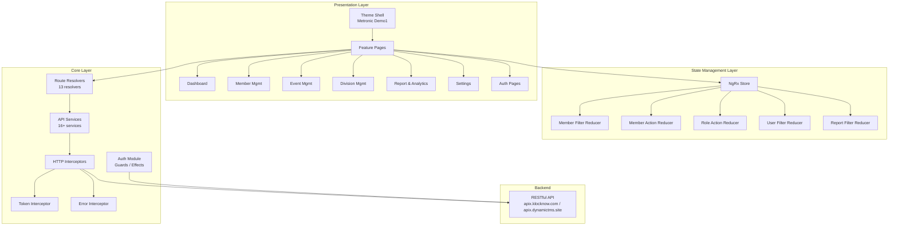

# UYFC HQ Admin App — Project Portfolio Documentation

---

## 1. Overview

**UYFC HQ Admin App** is a comprehensive headquarters-level administration panel built for the **Union of Youth Federations of Cambodia (UYFC)**. The platform serves as the central management hub for overseeing organizational membership, divisions, departments, events, reporting, and credential card issuance across all provincial/city-level branches.

Built with **Angular 8** and powered by the **Metronic** admin theme, the application delivers a professional, feature-rich dashboard for administrators to manage thousands of members, coordinate nationwide events, generate analytical reports, and administer role-based access control — all through a polished, responsive single-page application.

| Attribute            | Detail                                       |
| -------------------- | -------------------------------------------- |
| **Platform**         | Web Application (SPA)                        |
| **Framework**        | Angular 8.2.x                                |
| **UI Theme**         | Metronic Admin Template v6.0.4               |
| **State Management** | NgRx (Store, Effects, Router-Store)           |
| **UI Library**       | Angular Material 8 + ng-bootstrap 5          |
| **Language**         | TypeScript 3.4                               |
| **Styling**          | SCSS                                         |
| **Backend API**      | RESTful API (external service)               |
| **Authentication**   | Token-based (custom `Authorization-Token`)   |
| **Deployment**       | AWS Elastic Beanstalk (staging), Custom host  |

---

## 2. Project Structure

```
hq-admin-app/
├── angular.json                    # Angular CLI workspace configuration
├── package.json                    # Dependencies & npm scripts
├── proxyconfig.json                # Dev proxy to backend APIs
├── tsconfig.json                   # TypeScript compiler options
├── tslint.json                     # Linting rules
├── browserslist                    # Supported browsers
├── e2e/                            # End-to-end (Protractor) tests
│
└── src/
    ├── index.html                  # Application entry point
    ├── main.ts                     # Angular bootstrap
    ├── styles.scss                 # Global styles
    ├── polyfills.ts                # Browser polyfills
    ├── environments/
    │   ├── environment.ts          # Development environment config
    │   ├── environment.prod.ts     # Production environment config
    │   └── environment.staging.ts  # Staging environment config
    │
    └── app/
        ├── app.module.ts               # Root application module
        ├── app-routing.module.ts       # Top-level routing
        ├── app.component.ts            # Root component
        ├── material.module.ts          # Angular Material barrel module
        ├── token.interceptor.ts        # HTTP auth token interceptor
        ├── error.interceptor.ts        # HTTP error interceptor
        │
        ├── core/                       # Core shared layer
        │   ├── core.module.ts          # Core module (directives, pipes)
        │   ├── _base/
        │   │   ├── crud/               # CRUD utilities & layout utils
        │   │   └── layout/             # Layout directives & services
        │   ├── _config/                # Layout theme configuration
        │   ├── _pipes/                 # Custom pipes (Khmer date, gender, status, etc.)
        │   ├── auth/                   # Auth module (guards, effects, actions, services)
        │   │   ├── _actions/
        │   │   ├── _data-sources/
        │   │   ├── _effects/
        │   │   ├── _guards/
        │   │   ├── _models/
        │   │   ├── _reducers/
        │   │   ├── _selectors/
        │   │   ├── _server/
        │   │   └── _services/
        │   ├── models/                 # Data models & interfaces
        │   │   ├── member.ts
        │   │   ├── event.ts
        │   │   ├── department.ts
        │   │   ├── division-member.ts
        │   │   ├── report.model.ts
        │   │   ├── role.ts
        │   │   ├── notification.ts
        │   │   ├── card-status.enum.ts
        │   │   └── v2/                 # V2 models (card, member-card, etc.)
        │   ├── reducers/               # Root NgRx reducers
        │   ├── resolves/               # Route resolvers (13 resolvers)
        │   └── services/               # API services (16+ services)
        │       ├── abstract-service.ts
        │       ├── member.service.ts
        │       ├── event.service.ts
        │       ├── dashboard.service.ts
        │       ├── report.service.ts
        │       ├── division.service.ts
        │       ├── department.service.ts
        │       ├── role.service.ts
        │       ├── notification.service.ts
        │       ├── export-excel.service.ts
        │       ├── banner.service.ts
        │       ├── image.service.ts
        │       └── v2/                 # V2 API services
        │
        └── views/
            ├── pages/                  # Feature page modules
            │   ├── auth/               # Authentication pages
            │   │   ├── login/
            │   │   ├── forget-password/
            │   │   ├── new-password/
            │   │   ├── verify/
            │   │   ├── register/
            │   │   └── two-factory-verify-pin/
            │   ├── dashboard/          # Dashboard & analytics charts
            │   │   ├── chart-general-data/
            │   │   ├── chart-interview-data/
            │   │   └── chart-last-general-data/
            │   ├── member/             # Member management
            │   │   ├── list-member/
            │   │   ├── data-entry/
            │   │   ├── member-detail/
            │   │   ├── member-action/
            │   │   ├── member-filter/
            │   │   ├── card/
            │   │   ├── crop-image/
            │   │   ├── department/
            │   │   ├── request-card/
            │   │   └── member-requesting-card/
            │   ├── division/           # Division & department management
            │   │   ├── list-division/
            │   │   └── department/
            │   ├── event/              # Event management (CRUD)
            │   │   ├── event-list/
            │   │   ├── event-create/
            │   │   ├── event-detail/
            │   │   ├── event-form/
            │   │   ├── event-update/
            │   │   └── crop-image/
            │   ├── report/             # Reporting & analytics
            │   │   └── member/
            │   │       ├── export-member/
            │   │       ├── count-member-by-division/
            │   │       └── count-member-by-department/
            │   ├── setting/            # System settings
            │   │   ├── user/           # Admin user management
            │   │   ├── banner/         # Banner management
            │   │   └── crop-image/
            │   └── users/              # User profile
            │       └── user-profile/
            │
            ├── partials/               # Reusable partial components
            │   ├── content/
            │   └── layout/
            │
            └── themes/
                └── demo1/              # Metronic Demo 1 theme shell
                    ├── theme.module.ts
                    ├── pages-routing.module.ts
                    ├── aside/          # Sidebar navigation
                    ├── header/         # Top header bar
                    ├── footer/         # Footer
                    ├── brand/          # Brand logo area
                    ├── subheader/      # Page subheader
                    ├── base/           # Base layout wrapper
                    └── content/        # Content area & error pages
```

---

## 3. Architecture

The application follows a **modular, layered architecture** designed for scalability and maintainability:



### Key Architectural Decisions

- **Lazy-Loaded Feature Modules**: Each major feature (Dashboard, Member, Event, Division, Report, Setting, Users) is a lazy-loaded Angular module, minimizing initial bundle size.
- **NgRx State Management**: Complex filtering and cross-component state (member filters, role actions, report filters) are managed through NgRx store with dedicated reducers per feature.
- **Route Resolvers**: 13 resolver classes pre-fetch data before route activation, ensuring pages render with data already available.
- **Abstract Service Pattern**: All API services extend `AbstractService`, which centralizes `baseUrl` and `HttpClient` injection for consistent API communication.
- **HTTP Interceptors**: A `TokenInterceptor` attaches authentication headers to every request, while an `ErrorInterceptor` standardizes error handling and 401 redirects.
- **Auth Guard**: All authenticated routes are protected by `AuthGuard`, ensuring only logged-in users can access the admin panel.

---

## 4. Technologies Used

### Core Framework & Language

| Technology        | Version | Purpose                            |
| ----------------- | ------- | ---------------------------------- |
| Angular           | 8.2.14  | Frontend SPA framework             |
| TypeScript        | 3.4.5   | Typed JavaScript superset          |
| RxJS              | 6.5.4   | Reactive programming & async ops   |
| Zone.js           | 0.9.1   | Angular change detection           |

### State Management

| Technology            | Version | Purpose                            |
| --------------------- | ------- | ---------------------------------- |
| @ngrx/store           | 8.6.0   | Centralized state container        |
| @ngrx/effects         | 8.6.0   | Side-effect management             |
| @ngrx/router-store    | 8.6.0   | Router state sync with NgRx        |
| @ngrx/entity          | 8.6.0   | Entity collection management       |
| ngrx-store-freeze     | 0.2.4   | Immutability enforcement (dev)     |

### UI & Styling

| Technology                    | Version | Purpose                            |
| ----------------------------- | ------- | ---------------------------------- |
| Metronic Admin Theme          | 6.0.4   | Premium admin dashboard template   |
| Angular Material              | 8.2.3   | Material Design components         |
| @ng-bootstrap/ng-bootstrap    | 5.1.5   | Bootstrap-based Angular components |
| SCSS                          | —       | Preprocessed stylesheets           |
| Material Design Icons         | 3.0.1   | Icon set                           |
| Poppins + Battambang Fonts    | —       | Latin & Khmer typography           |

### Data Visualization & Charts

| Technology            | Version | Purpose                            |
| --------------------- | ------- | ---------------------------------- |
| Chart.js              | 2.9.3   | Canvas-based charts                |
| Chartist              | 0.11.4  | SVG-based charts                   |
| Google Charts          | 1.0.0-β | Google-powered charting            |

### Mapping & Location

| Technology  | Version | Purpose                                |
| ----------- | ------- | -------------------------------------- |
| @agm/core   | 1.1.0   | Google Maps Angular integration        |

### Calendar & Date

| Technology                          | Version | Purpose                            |
| ----------------------------------- | ------- | ---------------------------------- |
| @fullcalendar/angular               | 4.3.1   | Calendar views (day/time grid)     |
| ngx-daterangepicker-material        | 1.0.2   | Date range picker                  |
| Moment.js                           | 2.24.0  | Date manipulation & formatting     |

### Export & File Handling

| Technology        | Version   | Purpose                            |
| ----------------- | --------- | ---------------------------------- |
| xlsx              | 0.14.4    | Excel file generation              |
| file-saver        | 2.0.2     | Client-side file downloads         |
| jspdf             | 1.5.3     | PDF generation                     |
| html2canvas       | 1.0.0-rc5 | HTML-to-canvas rendering           |

### Image & Media

| Technology            | Version | Purpose                            |
| --------------------- | ------- | ---------------------------------- |
| ngx-image-cropper     | 1.5.1   | Image cropping (member photos)     |
| ngx-lightbox          | 2.1.1   | Image lightbox viewer              |

### Utilities & UX

| Technology                | Version | Purpose                            |
| ------------------------- | ------- | ---------------------------------- |
| ngx-permissions           | 7.0.2   | Role-based UI permissions          |
| ngx-pagination            | 4.1.0   | Table pagination                   |
| ngx-perfect-scrollbar     | 8.0.0   | Custom scrollbar                   |
| SweetAlert2               | 8.19.0  | Beautiful alert/confirmation dialogs |
| QRCode                    | 1.5.4   | QR code generation                 |
| ngx-clipboard             | 12.3.0  | Clipboard copy functionality       |
| ngx-highlightjs           | 3.0.3   | Code syntax highlighting           |
| Lodash                    | 4.17.15 | Utility library                    |

### Security

| Technology               | Purpose                              |
| ------------------------ | ------------------------------------ |
| Google reCAPTCHA v2      | Bot protection on auth forms         |
| Two-Factor Auth (2FA)    | PIN-based verification               |
| Token-based Auth         | Custom `Authorization-Token` header  |
| IP Detection (ipify)     | Client IP tracking with fallback     |

### Testing

| Technology                | Version | Purpose                            |
| ------------------------- | ------- | ---------------------------------- |
| Karma                     | 4.4.1   | Test runner                        |
| Jasmine                   | 3.4.0   | Testing framework                  |
| Protractor                | 5.4.2   | End-to-end testing                 |

---

## 5. Key Features

### 5.1 Authentication & Security
- **Login** with token-based authentication (`Authorization-Token` header)
- **Forgot Password** flow with OTP verification
- **Two-Factor Authentication (2FA)** via PIN verification
- **Password Reset** with secure token-based links
- **Google reCAPTCHA** integration for bot protection
- **Auth Guard** protecting all admin routes with automatic 401 → login redirect
- **Client IP tracking** via ipify with jsonip.com fallback

### 5.2 Dashboard & Analytics
- **Real-time overview** of organizational metrics
- **Chart visualizations** powered by Chart.js, Chartist, and Google Charts:
  - General data charts — membership overview
  - Interview data charts — recruitment tracking
  - Historical comparison charts — trend analysis
- Division-wise member distribution summary

### 5.3 Member Management
- **Full CRUD operations** for member records
- **Advanced filtering**: division, department, gender, age range, card status, member type, verification status, role, date ranges (registration, interview, deactivation)
- **Sorting & pagination** with configurable page sizes
- **Member detail view** with complete profile information
- **Photo management** with built-in image cropper
- **Data entry forms** for new member registration
- **Bulk operations** (multi-delete)
- **Account activation/deactivation** toggle
- **Password reset** for individual members
- **Permission assignment** for reporting departments

### 5.4 Membership Card System
- **Card request workflow**: Request → Approval → Processing → Issued/Rejected
- **Bulk card approval & rejection** for efficient batch processing
- **Card status tracking** with enum-based status management
- **Requesting card views** by department and division
- **QR code generation** for member cards
- **PDF export** of member cards via jspdf + html2canvas

### 5.5 Division & Department Management
- **Provincial/City-level division** listing and management
- **Department CRUD** (Create, Read, Update, Delete) within divisions
- **Hierarchical navigation**: Division → Department → Members

### 5.6 Event Management
- **Complete CRUD** for organizational events
- **Event scheduling** with date-range filtering
- **Event detail view** with full event information
- **Member invitation system**: invite members to events, track responses
- **Registration & invitation tracking** with gender filtering and pagination
- **Attendance management** with status-based filtering
- **Image support** with cropping for event banners

### 5.7 Reporting & Data Export
- **Member information reports** with multi-dimensional filtering (division, department, date range, member level)
- **Member count by division** — aggregate statistics
- **Member count by department** — drill-down analytics
- **UPI card reports** — card issuance analytics
- **Excel export** (XLSX) for any report dataset
- **Member data export** with customizable filters

### 5.8 Settings & Administration
- **Admin user management** with role-based assignment
- **Role management**: assign/remove users from roles with granular permissions (expert, chat group, accept card)
- **Banner management** for the mobile app/website
- **Image cropping** for banner uploads

### 5.9 User Profile
- Personal profile management for logged-in administrators

### 5.10 Notifications
- Real-time notification feed
- Mark as read (individual and bulk)
- Type-based notification filtering

### 5.11 Internationalization & Localization
- **Khmer language support** with custom pipes (`KhmerDatePipe`, Battambang font)
- **Khmer date formatting** for local date display
- **Content-Language header** set to `kh` for all API requests
- Built-in `@ngx-translate/core` for future multi-language expansion

---

## 6. Installation

### Prerequisites

- **Node.js** — v10.x or v12.x recommended (for Angular 8 compatibility)
- **npm** — v6.x
- **Angular CLI** — v8.3.x

### Steps

```bash
# 1. Clone the repository
git clone <repository-url> hq-admin-app
cd hq-admin-app

# 2. Install dependencies
npm install

# 3. Start the development server
npm start
# → Runs on http://localhost:4200

# 4. Start with API proxy (for backend integration)
npm run proxy
# → Proxies /uyfcapi/* → http://uyfcapi.dev/
# → Proxies /staging/* → AWS Elastic Beanstalk staging
# → Proxies /production/* → https://apix.klocknow.com/v2/

# 5. Build for production
npm run build
# → Outputs to dist/production/

# 6. Run unit tests
npm test

# 7. Run end-to-end tests
npm run e2e

# 8. Analyze bundle size
npm run bundle-report
```

---

## 7. Configuration

### Environment Files

The application supports three environments:

| File                        | Environment | API Base URL                                                     |
| --------------------------- | ----------- | ---------------------------------------------------------------- |
| `environment.ts`            | Development | `https://apix.dynamictms.site`                                   |
| `environment.staging.ts`    | Staging     | AWS Elastic Beanstalk endpoint                                   |
| `environment.prod.ts`       | Production  | `https://apix.klocknow.com/v2`                                   |

### Environment Variables

Each environment file exports the following configuration:

```typescript
export const environment = {
  production: boolean,          // Enable/disable production mode
  isMockEnabled: boolean,       // Toggle in-memory mock API
  authTokenKey: string,         // LocalStorage key for auth token
  secretKey: string,            // API secret key
  baseUrl: string,              // Backend API base URL
  googleMapApiKey: string,      // Google Maps API key
  googleRecaptchaSiteKey: string, // reCAPTCHA site key
  clientId: string,             // OAuth client identifier
};
```

### Proxy Configuration

The `proxyconfig.json` configures Angular CLI's dev server proxy:

| Route           | Target                                     | Purpose              |
| --------------- | ------------------------------------------ | -------------------- |
| `/production/*` | `https://apix.klocknow.com/v2/`            | Production API proxy |
| `/uyfcapi/*`    | `http://uyfcapi.dev/`                      | Local dev API proxy  |
| `/staging/*`    | AWS Elastic Beanstalk (us-west-2)          | Staging API proxy    |

### Build Configurations

| Configuration | Output Path       | Options                                     |
| ------------- | ----------------- | ------------------------------------------- |
| Default       | `dist/development` | Standard development build                  |
| Production    | `dist/production`  | AOT, optimization, hashing, vendor chunking |
| Testing       | `hq/`              | Custom `baseHref` and `deployUrl` (`/hq/`)  |

---

## 8. Custom Pipes

The application includes several custom Angular pipes for localization and data transformation:

| Pipe                | File                     | Purpose                                      |
| ------------------- | ------------------------ | -------------------------------------------- |
| `KhmerDatePipe`     | `khmer-date.pipe.ts`     | Formats dates into Khmer calendar format     |
| `_KhmerDatePipe`    | `_khmer-date.pipe.ts`    | Alternative Khmer date formatting            |
| `GenderPipe`        | `gender.pipe.ts`         | Transforms gender codes to display labels    |
| `StatusPipe`        | `_status.pipe.ts`        | Maps status codes to human-readable labels   |
| `CardStatusPipe`    | `cardStatus.pipe.ts`     | Transforms card status enums to labels       |
| `MemberRolePipe`    | `member-role.pipe.ts`    | Converts role codes to display names         |
| `MemberTypePipe`    | `member-type.pipe.ts`    | Formats member type identifiers              |
| `PhoneNumberPipe`   | `phone-number.pipe.ts`   | Formats phone numbers for display            |
| `LanguageLevelPipe` | `language_level.pipe.ts` | Displays language proficiency levels         |

---

## 9. API Services

All API services extend the `AbstractService` base class, which provides:
- **Base URL** from environment configuration
- **HttpClient** injection
- **User ID** from localStorage for authenticated requests

| Service                  | Responsibilities                                             |
| ------------------------ | ------------------------------------------------------------ |
| `MemberService`          | Member CRUD, search, card approval/rejection, activation     |
| `EventService`           | Event CRUD, invitations, registrations                       |
| `DashboardService`       | Dashboard metrics, division member counts                    |
| `DivisionService`        | Division data retrieval                                      |
| `DepartmentService`      | Department management                                        |
| `ReportService`          | Member reports, UPI card reports                             |
| `RoleService`            | Role listing, user assignment/removal                        |
| `NotificationService`    | Notification feed, mark as viewed                            |
| `ExportExcelService`     | Excel file generation and download                           |
| `BannerService`          | Banner management                                            |
| `ImageService`           | Image upload management                                      |
| `CompanyService`         | Company/organization data                                    |
| `LocationService`        | Geographic location data                                     |
| `InterviewModeService`   | Interview mode configuration                                 |
| `ViewDataService`        | Data viewing utilities                                       |
| `V2/ApiService`          | V2 API base service                                          |
| `V2/CardService`         | V2 card management endpoints                                 |
| `V2/ReportService`       | V2 enhanced reporting endpoints                              |

---

## 10. Route Resolvers

The application uses 13 Angular route resolvers to pre-fetch data before route activation:

| Resolver                  | Purpose                                      |
| ------------------------- | -------------------------------------------- |
| `DashboardResolve`        | Pre-loads dashboard summary data             |
| `MemberResolve`           | Fetches paginated member listings            |
| `MemberCountResolve`      | Retrieves member count by card status        |
| `MemberDivisionResolve`   | Loads division-level member data             |
| `MembersActionResolve`    | Pre-fetches member action context            |
| `DepartmentResolve`       | Loads department data for card requests      |
| `DivisionResolve`         | Fetches all divisions                        |
| `EventListResolve`        | Loads event listings with date range         |
| `EventDetailResolve`      | Fetches single event details                 |
| `DataEntryResolve`        | Pre-loads form data for member data entry    |
| `InterviewResolve`        | Loads interview-related data                 |
| `RoleResolve`             | Fetches available roles for assignment       |
| `UserResolve`             | Pre-loads admin user data                    |

---

## 11. Usage

### Accessing the Application

1. Navigate to the application URL (default: `http://localhost:4200`)
2. Log in with admin credentials on the `/auth/login` page
3. Complete 2FA PIN verification if enabled
4. You will be redirected to the **Dashboard** (`/dashboard`)

### Main Navigation

| Menu Item       | Route          | Description                              |
| --------------- | -------------- | ---------------------------------------- |
| Dashboard       | `/dashboard`   | Analytics overview & charts              |
| Division        | `/division`    | Manage city/province divisions           |
| Member          | `/member`      | Member CRUD & card management            |
| Events          | `/events`      | Event scheduling & invitations           |
| Report          | `/report`      | Member & card reports with export        |
| Setting         | `/setting`     | Admin users, roles, banners              |
| User Profile    | `/user-profile`| Personal profile management              |

### Common Workflows

#### Register a New Member
1. Navigate to **Member → Create** (`/member/create`)
2. Fill in the data entry form with member details
3. Upload and crop a member photo
4. Submit the registration

#### Manage Card Requests
1. Navigate to **Member → Request Card** (`/member/request-card`)
2. View pending card requests by division/department
3. Select members and **Approve** or **Reject** cards in bulk
4. Track card status progression: Requested → Processing → Issued/Rejected

#### Create an Event
1. Navigate to **Events → Create** (`/events/create`)
2. Fill in event details (title, date, location, description)
3. Upload and crop an event banner image
4. Save the event
5. From event detail, invite members to the event

#### Generate Reports
1. Navigate to **Report → Members** (`/report/members`)
2. Apply filters (division, department, date range, member level)
3. View aggregated statistics
4. Click **Export** to download as Excel (XLSX)

---

## 12. Deployment

### Production Build

```bash
# Build with production configuration
npm run build
# Output: dist/production/
```

### Testing/Staging Build

```bash
# Build with testing configuration (baseHref: /hq/)
ng build --configuration=testing
# Output: hq/
```

### Hosting

- **Production**: Deployed behind `https://apix.klocknow.com` infrastructure
- **Staging**: AWS Elastic Beanstalk (us-west-2 region)
- **Development**: Local Angular CLI dev server with API proxy

---

## 13. Summary

The **UYFC HQ Admin App** is a production-grade, enterprise-level administration platform that demonstrates expertise in:

- **Enterprise Angular architecture** with lazy-loaded modules, NgRx state management, and multi-environment configuration
- **Complex business workflows** including membership lifecycle management, card issuance pipelines, and event coordination
- **Data-driven dashboards** with multi-library chart integrations (Chart.js, Chartist, Google Charts)
- **Localization for Khmer language** with custom date pipes and Khmer font support
- **Role-based access control** with granular permissions and auth guards
- **Data export capabilities** (Excel, PDF) for reporting and auditing
- **Security best practices** including 2FA, reCAPTCHA, token-based auth, and HTTP interceptors
- **Scalable service architecture** with abstract service patterns and 16+ dedicated API services

This application serves as the operational backbone for UYFC's headquarters, managing organizational data across all provincial branches of Cambodia.
