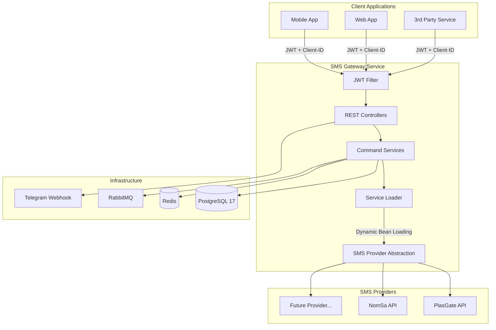
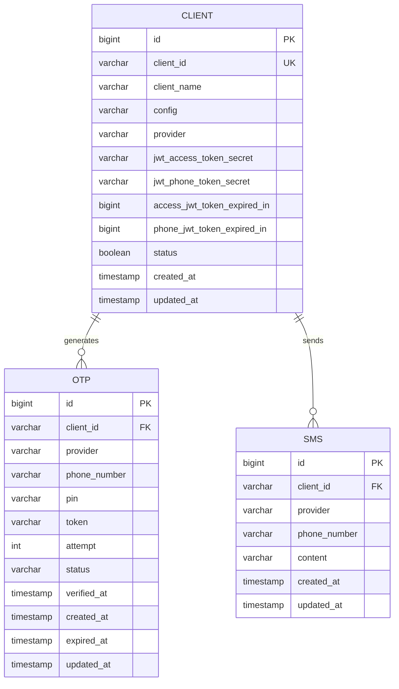
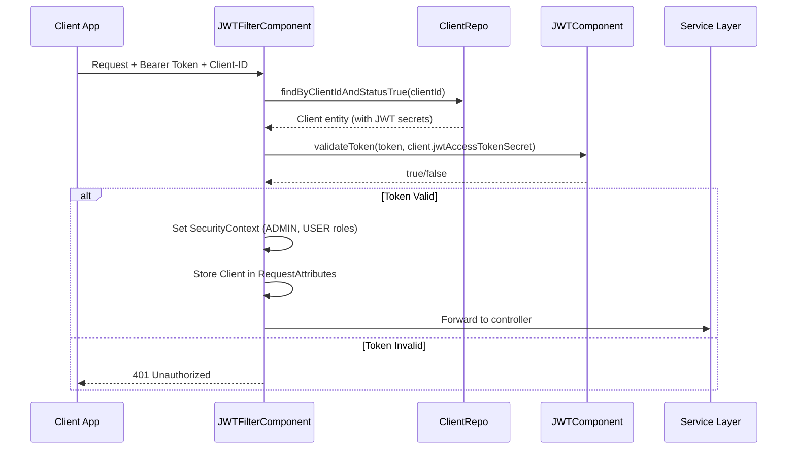
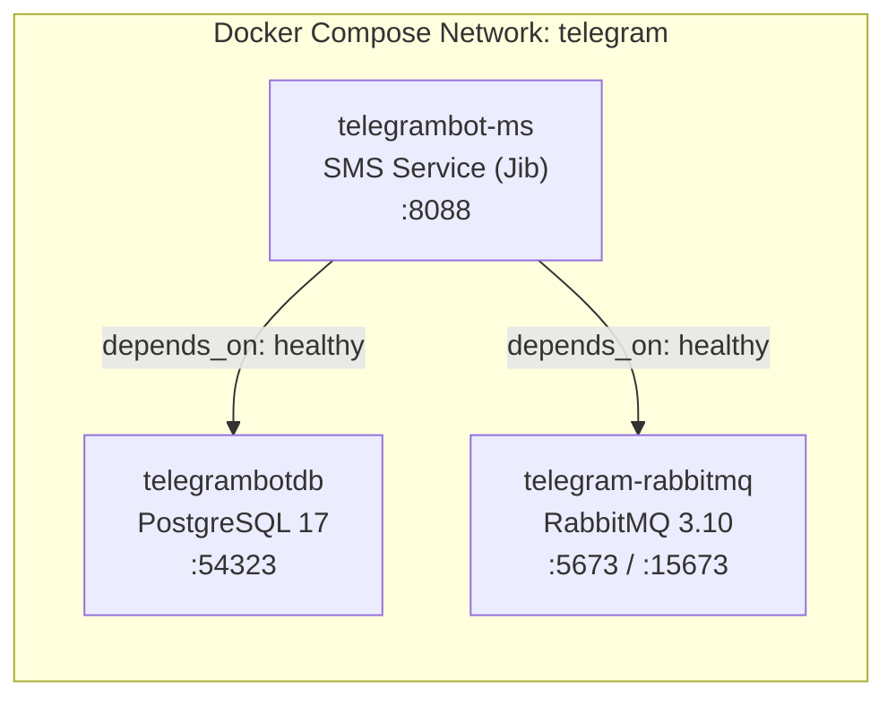

# 📱 SMS Java Service — Project Portfolio Documentation

> **Multi-Tenant SMS Gateway Microservice**
> A production-grade, provider-agnostic SMS delivery platform built with Spring Boot 3 and Java 21.

---

## 📋 Table of Contents

1. [Overview](#overview)
2. [Technology Stack](#technology-stack)
3. [Architecture](#architecture)
4. [Project Structure](#project-structure)
5. [Core Modules](#core-modules)
6. [Database Schema](#database-schema)
7. [API Reference](#api-reference)
8. [Security](#security)
9. [Configuration](#configuration)
10. [Infrastructure & Deployment](#infrastructure--deployment)
11. [Installation & Setup](#installation--setup)
12. [Key Features](#key-features)

---

## Overview

**SMS Java Service** is a multi-tenant SMS gateway microservice developed by **Bronx Technology**. It serves as a centralized backend platform that enables multiple client applications to send SMS messages and OTP (One-Time Password) verifications through pluggable SMS providers — currently supporting **PlasGate** and **NomSa** APIs.

The service is designed with a clean **Command Pattern** architecture, per-client JWT authentication, and full provider abstraction, allowing clients to onboard with their own credentials and SMS provider configurations without any code changes.

| Attribute          | Detail                                    |
|--------------------|-------------------------------------------|
| **Type**           | Backend Microservice (REST API)           |
| **Language**       | Java 21                                   |
| **Framework**      | Spring Boot 3.2.3 / 3.4.0                |
| **Database**       | PostgreSQL 17                             |
| **Caching**        | Redis (Lettuce)                           |
| **Message Broker** | RabbitMQ 3.10                             |
| **Auth**           | JWT (HMAC-SHA256) + Secret Key            |
| **API Docs**       | Springdoc OpenAPI (Swagger UI)            |
| **Containerization** | Docker + Docker Compose + Google Jib    |
| **Deployment**     | AWS EC2 (ARM64)                           |

---

## Technology Stack

### Core Framework & Language

| Technology                  | Version   | Purpose                                     |
|-----------------------------|-----------|---------------------------------------------|
| **Java**                    | 21        | Primary language with modern features       |
| **Spring Boot**             | 3.2.3     | Application framework                       |
| **Spring Security**         | 6.x       | Authentication & authorization              |
| **Spring Data JPA**         | 3.x       | ORM and data access layer                   |
| **Spring WebFlux**          | 3.x       | Reactive WebClient for HTTP integrations    |
| **Spring AMQP**             | 3.x       | RabbitMQ message broker integration         |
| **Spring Data Redis**       | 3.x       | Redis caching with Lettuce client           |
| **Spring Boot Actuator**    | 3.x       | Health checks, metrics & monitoring         |

### Data & Persistence

| Technology                  | Version   | Purpose                                     |
|-----------------------------|-----------|---------------------------------------------|
| **PostgreSQL**              | 17        | Relational database                         |
| **Hibernate**               | 6.x       | ORM framework                               |
| **Hypersistence Utils**     | 3.6.0     | Advanced Hibernate type support             |
| **Redis**                   | —         | Distributed caching & credit system         |

### Security & Auth

| Technology                  | Version   | Purpose                                     |
|-----------------------------|-----------|---------------------------------------------|
| **JJWT**                    | 0.11.5    | JWT token generation & validation           |
| **Spring Security**         | 6.x       | Filter chain, stateless session management  |

### Integration & Resilience

| Technology                  | Version   | Purpose                                     |
|-----------------------------|-----------|---------------------------------------------|
| **Resilience4j**            | 2.2.0     | Circuit breaker for Redis & RabbitMQ        |
| **ShedLock**                | 5.10.0    | Distributed scheduling lock (Redis-backed)  |
| **OkHttp**                  | 4.12.0    | HTTP client for external API calls          |
| **Apache HttpClient 5**     | —         | Alternative HTTP client                     |
| **TelegramBots**            | 6.9.7.1   | Telegram bot webhook integration            |

### Developer Tooling

| Technology                  | Version   | Purpose                                     |
|-----------------------------|-----------|---------------------------------------------|
| **Lombok**                  | 1.18.36   | Boilerplate code reduction                  |
| **MapStruct**               | 1.6.3     | Type-safe DTO mapping                       |
| **Springdoc OpenAPI**       | 2.8.4     | Swagger UI & API documentation              |
| **Google Jib**              | 3.4.2     | Daemonless Docker image builds              |
| **Maven**                   | —         | Build tool & dependency management          |

---

## Architecture

### High-Level Architecture Diagram



### Design Patterns

| Pattern                     | Implementation                              |
|-----------------------------|---------------------------------------------|
| **Command Pattern**         | `IBaseCommandService<T, Q>` — each business operation is a standalone, injectable service |
| **Strategy Pattern**        | `ISmsService<T, Q>` — SMS providers are interchangeable strategies loaded at runtime |
| **Service Locator Pattern** | `ServiceLoaderComponent` dynamically resolves SMS provider beans via Spring's `ApplicationContext` |
| **Template Method Pattern** | `BaseController.run()` — standardized controller execution flow |
| **DTO Pattern**             | Clean separation of request/response DTOs from domain entities |
| **Repository Pattern**      | Spring Data JPA repositories for data access |

---

## Project Structure

```
sms-java-service/
├── 01_build-images.sh              # Build Docker image via Jib
├── 02_save-docker-images.sh        # Export Docker image to .tar
├── 03_deploy-docker-image.sh       # SCP + deploy to AWS EC2
├── docker-compose.yml              # Full stack: PostgreSQL + RabbitMQ + App
├── pom.xml                         # Maven build configuration
├── .env                            # Environment variables
│
└── src/main/java/com/bronxtechnology/sms/sms/
    ├── component/                   # Cross-cutting components
    │   ├── JWTComponent.java        # JWT token generation & validation
    │   ├── JWTFilterComponent.java  # Spring Security JWT filter
    │   └── ServiceLoaderComponent.java  # Dynamic service resolution
    │
    ├── config/                      # Application configuration
    │   ├── AppConfig.java           # General app beans
    │   └── SecurityConfig.java      # Spring Security filter chain + CORS
    │
    ├── constant/                    # Constants & route definitions
    │   ├── HttpConstant.java        # HTTP header constants
    │   └── ROUTE.java               # API route path constants
    │
    ├── controller/                  # REST API controllers
    │   ├── BaseController.java      # Abstract controller with command runner
    │   ├── ClientController.java    # Client registration & management
    │   ├── MessageController.java   # SMS message sending
    │   ├── OtpController.java       # OTP send & verify
    │   └── TestController.java      # Development/testing endpoints
    │
    ├── dto/                         # Data Transfer Objects
    │   ├── ClientDto.java           # Client response DTO
    │   ├── ClientRegisterDto.java   # Client registration request DTO
    │   ├── PlasGateConfigDto.java   # PlasGate provider config
    │   ├── SmsOutDto.java           # Outbound SMS payload
    │   ├── SmsSendResDto.java       # SMS send response
    │   └── http/                    # HTTP-specific DTOs
    │       ├── ConfigDto.java       # Generic config DTO
    │       ├── request/             # Request DTOs
    │       └── response/            # Response DTOs (ApiResDto, SendOtpResDto, etc.)
    │
    ├── enums/                       # Enumerations
    │   ├── StatusCode.java          # API response status codes
    │   └── VerifyPhoneStatus.java   # OTP verification states
    │
    ├── model/                       # JPA Entities
    │   ├── Client.java              # Client tenant entity
    │   ├── Otp.java                 # OTP record entity
    │   └── Sms.java                 # SMS log entity
    │
    ├── repo/                        # Spring Data Repositories
    │   ├── ClientRepo.java          # Client data access
    │   ├── OtpRepo.java             # OTP data access
    │   └── SmsRepo.java             # SMS log data access
    │
    └── service/                     # Business Logic Layer
        ├── IBaseCommandService.java  # Command pattern interface
        ├── ISmsService.java          # SMS provider abstraction interface
        ├── ClientRegisterService.java    # Client management interface
        ├── NomSaService.java         # NomSa SMS provider implementation
        ├── PlasGateAPIService.java   # PlasGate SMS provider implementation
        ├── Impl/
        │   └── ClientRegisterServiceImpl.java  # Client management implementation
        └── sms/
            ├── SendMessageService.java   # Direct SMS sending command
            ├── SendOtpService.java       # OTP generation & dispatch command
            └── VerifyOtpService.java     # OTP verification command
```

---

## Core Modules

### 1. Client Management Module

The multi-tenant foundation of the system. Each client is an independent tenant with:
- Unique **Client ID** for identification
- **SMS Provider** assignment (PlasGate or NomSa)
- **Provider configuration** (API keys, secrets, sender ID, endpoint URL) stored as JSON
- **Independent JWT secrets** for access tokens and phone tokens
- **Configurable token expiration** durations
- **Soft-delete** capability via status flag

**Key Operations:** Register, Get by ID, List All, Search, Update, Delete (soft)

### 2. OTP Module

Complete OTP lifecycle management:
- **Send OTP** — Generates a cryptographically random 6-digit OTP, dispatches via the client's configured SMS provider, and issues a JWT phone token
- **Verify OTP** — Validates the phone token, checks OTP match, tracks verification attempts, and updates status to `VERIFIED`
- Full **audit trail** with timestamps and attempt counting

### 3. SMS Messaging Module

Direct SMS sending capability:
- Sends arbitrary text messages to phone numbers via the client's SMS provider
- Full logging of all sent messages in the database
- Input validation for phone number format and content

### 4. SMS Provider Abstraction

Pluggable SMS provider architecture via the Strategy pattern:
- **`ISmsService<T, Q>`** — Generic interface for SMS dispatch
- **`PlasGateAPIService`** — Integration with PlasGate Cloud API (`X-Secret` header auth, private key URL param)
- **`NomSaService`** — Integration with NomSa API (Bearer token auth)
- **`ServiceLoaderComponent`** — Dynamically resolves the correct provider bean at runtime based on client configuration

### 5. Credit System

Configurable credit/subscription management:
- **Redis-based batch credit tracking** for high-throughput scenarios
- Configurable sync intervals and batch sizes for DB persistence
- Retry mechanism for failed credit operations

### 6. Resilience & Reliability

Production hardening with:
- **Resilience4j Circuit Breakers** for Redis and RabbitMQ connections
- **ShedLock** for distributed scheduling (prevents duplicate cron jobs across instances)
- **RabbitMQ retry policies** with exponential backoff (3 attempts, 3s initial, 2x multiplier)

### 7. Monitoring & Health

- **Spring Boot Actuator** with health, readiness, and liveness probes
- **Prometheus metrics** endpoint for observability
- **Docker Compose health checks** — cascading dependency health verification

---

## Database Schema



---

## API Reference

### Base URL
```
http://localhost:8088
```

### Authentication

All API requests require:
- **`Authorization: Bearer <JWT_ACCESS_TOKEN>`** — Per-client JWT token (HMAC-SHA256)
- **`Client-ID: <CLIENT_ID>`** — Identifies the tenant

Client management endpoints use a static **Secret Key** in the `Authorization` header.

---

### OTP Endpoints

#### Send OTP
```http
POST /api/otp/send
```
| Header          | Value                          |
|-----------------|--------------------------------|
| Authorization   | `Bearer <accessToken>`         |
| Client-ID       | `<clientId>`                   |

**Request Body:**
```json
{
  "phoneNumber": "+85599123456"
}
```

**Response (200):**
```json
{
  "data": {
    "phoneToken": "eyJhbGciOiJIUzI1NiJ9..."
  },
  "statusCode": "SUCCESS"
}
```

#### Verify OTP
```http
POST /api/otp/verify
```

**Request Body:**
```json
{
  "phoneToken": "eyJhbGciOiJIUzI1NiJ9...",
  "otp": "123456"
}
```

**Response (200):**
```json
{
  "data": "+85599123456",
  "statusCode": "SUCCESS"
}
```

---

### Message Endpoints

#### Send SMS
```http
POST /api/message/send
```

**Request Body:**
```json
{
  "to": "+85599123456",
  "content": "Hello from SMS Service!"
}
```

---

### Client Management Endpoints

| Method   | Endpoint                      | Description            |
|----------|-------------------------------|------------------------|
| `POST`   | `/api/client/register`        | Register a new client  |
| `GET`    | `/api/client/{clientId}`      | Get client by ID       |
| `GET`    | `/api/client/all`             | List all clients       |
| `GET`    | `/api/client/search/{query}`  | Search by ID or name   |
| `PUT`    | `/api/client/{clientId}`      | Update client          |
| `DELETE` | `/api/client/{clientId}`      | Soft-delete client     |

---

### API Documentation (Swagger)

| Resource       | URL                                      |
|----------------|------------------------------------------|
| **Swagger UI** | `http://localhost:8088/swagger-ui-custom.html` |
| **OpenAPI JSON** | `http://localhost:8088/api-docs`        |

---

## Security

### Authentication Flow



### Key Security Features

- **Stateless JWT Sessions** — No server-side session storage
- **Per-Client JWT Secrets** — Each tenant has independent signing keys
- **Separate Token Types** — Access tokens and phone tokens use different secrets
- **CORS Configured** — Open CORS policy for API gateway integration
- **CSRF Disabled** — Appropriate for stateless REST APIs
- **Soft Delete** — Clients are deactivated, not removed, preserving audit trails

---

## Configuration

### Environment Variables

| Variable                    | Default                | Description                          |
|-----------------------------|------------------------|--------------------------------------|
| `DATASOURCE_URL`            | `localhost`            | PostgreSQL host                      |
| `DATASOURCE_PORT`           | `54323`                | PostgreSQL port                      |
| `DATASOURCE_DATABASE`       | `smsdb`                | Database name                        |
| `DATASOURCE_USERNAME`       | `SmsUser`              | DB username                          |
| `DATASOURCE_PASSWORD`       | `SmsUserPassword`      | DB password                          |
| `SECRET_KEY`                | (default hash)         | Admin secret key                     |
| `REDIS_HOST`                | `localhost`            | Redis host                           |
| `REDIS_PORT`                | `63790`                | Redis port                           |
| `RABBITMQ_HOST`             | `localhost`            | RabbitMQ host                        |
| `RABBITMQ_PORT`             | `5673`                 | RabbitMQ AMQP port                   |
| `RABBITMQ_USERNAME`         | `user`                 | RabbitMQ username                    |
| `RABBITMQ_PASSWORD`         | `pass`                 | RabbitMQ password                    |
| `RABBITMQ_IS_ENABLE`        | `false`                | Enable/disable RabbitMQ              |
| `CREDIT_MODE`               | `REDIS_BATCH`          | Credit tracking strategy             |
| `SLACK_ENABLED`             | `false`                | Enable Slack notifications           |
| `SLACK_WEBHOOK_URL`         | —                      | Slack incoming webhook URL           |
| `TELEGRAM_WEBHOOK_BASE_URL` | (ngrok URL)            | Telegram bot webhook base URL        |
| `PROFILE`                   | —                      | Spring active profile                |
| `HIBERNATE_DDL_AUTO`        | `update`               | Hibernate DDL strategy               |

---

## Infrastructure & Deployment

### Docker Compose Stack



### Deployment Pipeline (3-Step)

The project includes a streamlined CI/CD-ready deployment workflow:

| Step | Script                      | Action                                        |
|------|-----------------------------|-----------------------------------------------|
| 1    | `01_build-images.sh`        | Compile & build Docker image via **Google Jib** (no Dockerfile needed) |
| 2    | `02_save-docker-images.sh`  | Export image to `.tar` for offline transfer    |
| 3    | `03_deploy-docker-image.sh` | SCP to AWS EC2, `docker load`, and restart via `docker-compose` |

**Target Platform:** `linux/arm64` (AWS Graviton / ARM-based EC2)

---

## Installation & Setup

### Prerequisites

- **Java 21** (JDK)
- **Maven 3.8+**
- **Docker** & **Docker Compose**
- **PostgreSQL 17** (or use Docker Compose)

### Quick Start (Docker Compose)

```bash
# 1. Clone the repository
git clone <repository-url>
cd sms-java-service

# 2. Configure environment
cp .env.example .env
# Edit .env with your values

# 3. Start full stack (DB + RabbitMQ + App)
docker compose up -d

# 4. Verify health
curl http://localhost:8088/actuator/health
```

### Local Development

```bash
# 1. Start infrastructure only
docker compose up -d telegrambotdb rabbitmqtb

# 2. Run application
./mvnw spring-boot:run

# 3. Access Swagger UI
open http://localhost:8088/swagger-ui-custom.html
```

### Build & Deploy to Production

```bash
# Step 1: Build Docker image
./01_build-images.sh 1.0.1

# Step 2: Save image as tar
./02_save-docker-images.sh 1.0.1

# Step 3: Deploy to EC2
export SERVER_USER=ec2-user
export SERVER_IP=<your-ec2-ip>
./03_deploy-docker-image.sh 1.0.1
```

---

## Key Features

### ✅ Multi-Tenant Architecture
- Each client operates as an independent tenant with isolated credentials, provider configurations, and JWT secrets
- No cross-tenant data leakage — all operations are scoped to the authenticated client

### ✅ Provider-Agnostic SMS Delivery
- Pluggable SMS provider system via Strategy pattern
- Currently supports **PlasGate** and **NomSa** providers
- New providers require only a new `ISmsService` implementation — zero changes to business logic

### ✅ Complete OTP Lifecycle
- 6-digit OTP generation with secure randomization
- JWT-secured phone tokens with configurable expiration
- Attempt tracking and status management (PENDING → VERIFIED)

### ✅ Production-Grade Resilience
- **Circuit breakers** (Resilience4j) for Redis and RabbitMQ
- **Distributed scheduling** (ShedLock) for safe cron execution
- **RabbitMQ retry** with exponential backoff
- **WebClient connection pooling** (500 max connections)

### ✅ Comprehensive Monitoring
- Spring Boot Actuator with health, readiness, and liveness probes
- Prometheus metrics endpoint for Grafana/alerting integration
- Docker Compose health checks with cascading dependency verification

### ✅ Automated Deployment Pipeline
- Dockerless builds via Google Jib (no Dockerfile required)
- 3-step scripted deployment: Build → Save → Deploy
- ARM64 platform targeting for cost-effective AWS Graviton instances

### ✅ Developer Experience
- Swagger UI for interactive API exploration
- Lombok for boilerplate elimination
- MapStruct for type-safe DTO mapping
- Externalized configuration with sensible defaults

### ✅ Slack & Telegram Integration
- Configurable Slack webhook notifications
- Telegram bot webhook support for messaging workflows

---

> **Bronx Technology** · SMS Java Service · Spring Boot 3 · Java 21
